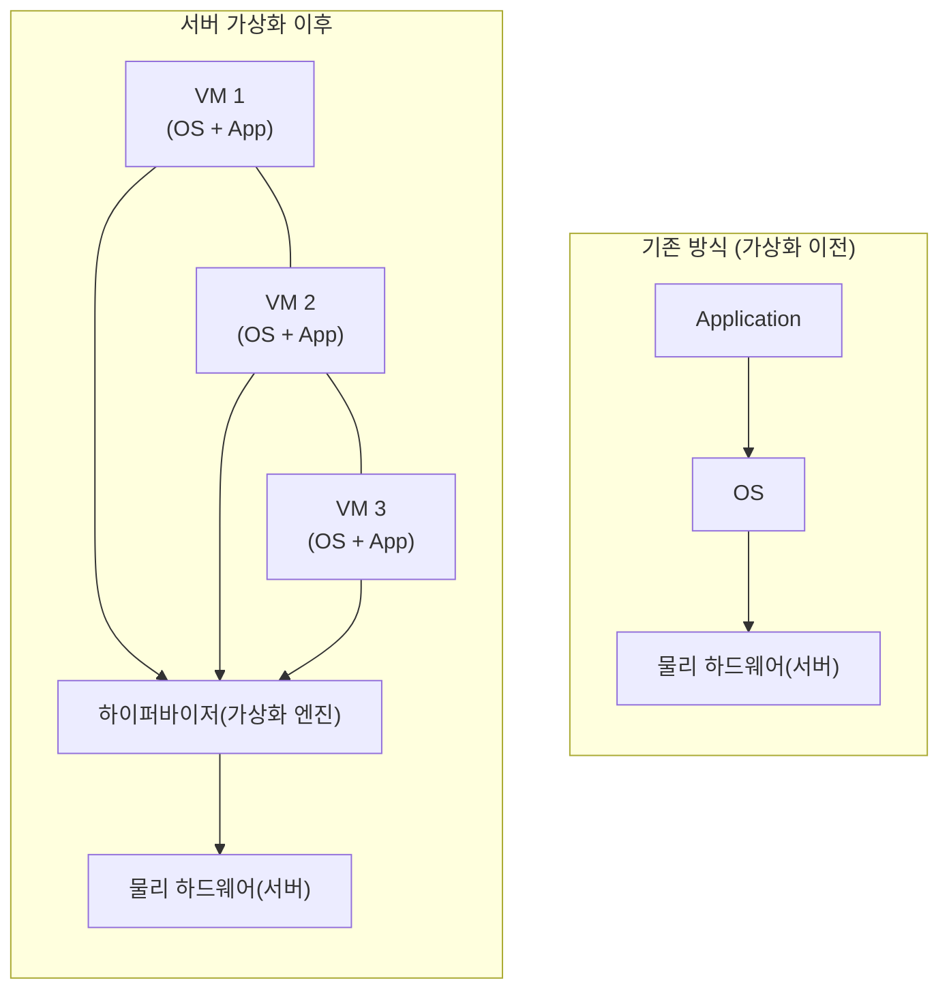
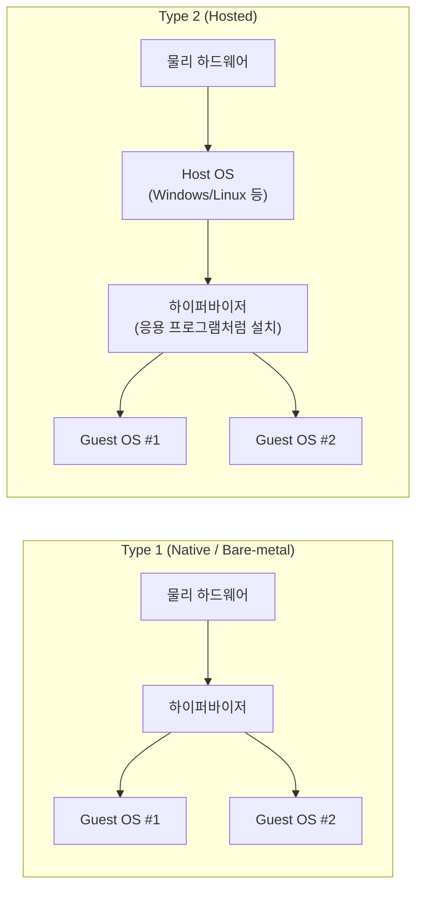
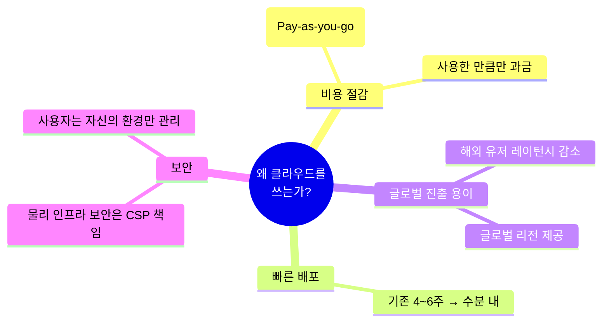
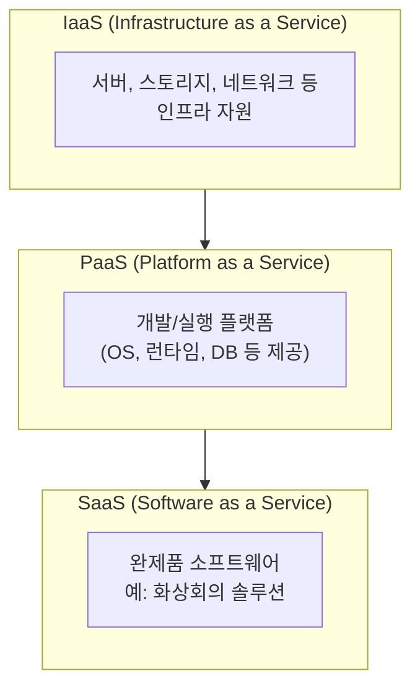
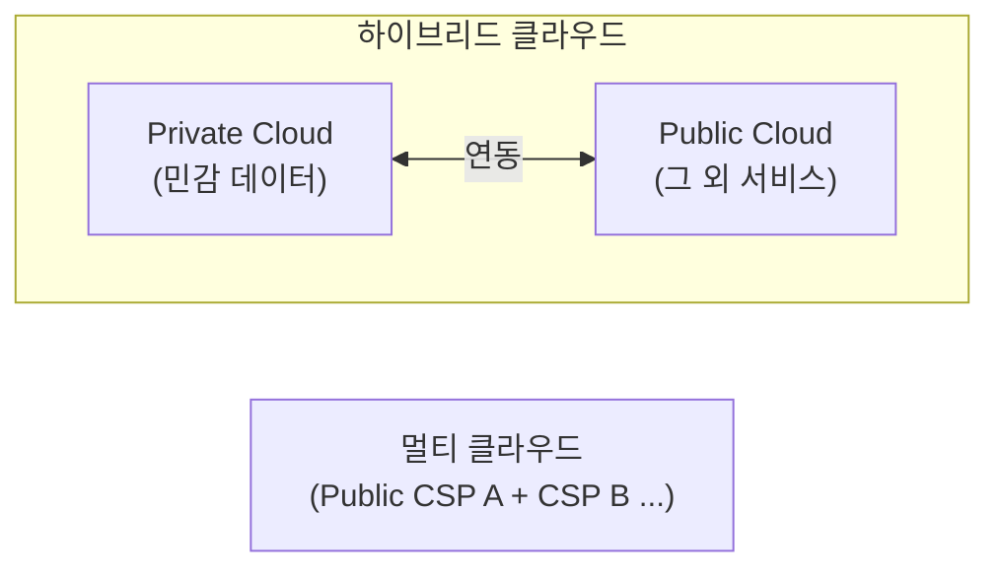

# 📘 1강. 가상화 기술과 클라우드 개요

> 네이버 클라우드 플랫폼(NCP) 공인교육 강의 내용을 정리한 노트입니다.
> 이 문서 하나만 보고도 개념을 복습할 수 있도록, 강의 원문 내용 + 이해를 돕기 위한 보충 설명(💡)을 함께 정리했습니다.

---

## 📑 목차

1. [가상화(Virtualization) 기술의 이해](#1-가상화virtualization-기술의-이해)
2. [네이버 클라우드의 역사](#2-네이버-클라우드의-역사)
3. [클라우드를 쓰는 이유 (4가지 장점)](#3-클라우드를-쓰는-이유-4가지-장점)
4. [클라우드 서비스 제공 형태: IaaS / PaaS / SaaS](#4-클라우드-서비스-제공-형태-iaas--paas--saas)
5. [클라우드 구축(배포) 방식](#5-클라우드-구축배포-방식)
6. [NCP 인프라 상품군](#6-ncp-인프라-상품군)
7. [🔑 핵심 암기 포인트 (시험 대비)](#7-핵심-암기-포인트-시험-대비)

---

## 1. 가상화(Virtualization) 기술의 이해

클라우드의 근간이 되는 핵심 기술이 바로 **가상화(Virtualization)** 입니다. 클라우드 서비스 자체를 이해하기 전에, "왜 클라우드가 가능한가?"에 대한 답이 가상화 기술입니다.

### 1.1 가상화 기술의 역사

| 시기 | 내용 |
|---|---|
| **1960년대** | '가상화(Virtualization)'라는 용어 최초 등장 |
| **IBM (1960년대)** | 메인프레임(Mainframe)에 가상화 기술을 최초로 적용, 시장에 출시 |
| **2000년대 초반** | IT 기술 확산 → 데이터센터 대규모 구축 → 서버 1대에서 여러 애플리케이션/환경을 구동하려는 수요 증가 |
| **2001년** | **VMware**가 세계 최초의 **상용 하이퍼바이저**를 출시 |

> 💡 **보충 설명**: 초기 메인프레임 시절에는 고가의 하드웨어 자원을 여러 부서·업무가 나눠 써야 했기 때문에 "물리 자원 하나를 논리적으로 쪼개 쓰는" 가상화 개념이 처음 등장했습니다. 이 개념이 2000년대 x86 서버 시장으로 넘어오면서 오늘날 클라우드의 기반 기술이 되었습니다.

### 1.2 서버 가상화(Server Virtualization)란?

서버 가상화는 **가상화 기술의 가장 시초가 되는 형태**로, 물리 서버 1대를 여러 개의 논리적인 서버(가상 머신, VM)처럼 나누어 쓰는 기술입니다.

- **기존 방식**: 물리 하드웨어 1대 위에 OS 1개, 그 위에 애플리케이션이 구동되는 1:1 구조 → 자원 낭비가 큼
- **가상화 방식**: 물리 하드웨어 위에 **하이퍼바이저(가상화 엔진)** 를 올리고, 그 위에 **여러 개의 VM이 독립적으로** 구동됨 → 하나의 물리 자원을 여러 워크로드가 나눠 씀 → 자원 효율 극대화

> 💡 **보충 설명**: 하이퍼바이저(Hypervisor)는 VMM(Virtual Machine Monitor)이라고도 불리며, 물리 자원(CPU, 메모리, 스토리지, 네트워크)을 각 VM에 논리적으로 분배·중재하는 소프트웨어 계층입니다. 각 VM은 서로의 존재를 모르는 채 "내가 물리 서버를 통째로 쓰고 있다"고 착각하며 독립적으로 동작합니다.

### 1.3 서버 가상화의 분류: Type 1 vs Type 2

서버 가상화는 하이퍼바이저가 어디에 설치되는지에 따라 **Type 1**과 **Type 2**로 나뉩니다.

| 구분 | **Type 1 (Native / Bare-metal)** | **Type 2 (Hosted)** |
|---|---|---|
| 구조 | 하드웨어 **바로 위**에 하이퍼바이저 설치 → 그 위에 여러 OS(VM) 구동 | 하드웨어 위에 **호스트 OS**가 먼저 설치되고, 그 OS 위에 하이퍼바이저가 응용프로그램처럼 설치됨 |
| 특징 | OS를 거치지 않아 성능 손실이 적음, 서버/데이터센터/클라우드 환경에 주로 사용 | 기존 OS 환경 위에서 손쉽게 가상 환경 구성 가능, 개인 PC 등에서 주로 사용 |
| 대표 제품 | **Xen**, **KVM** | **VMware Workstation** |

> 💡 **보충 설명**: 클라우드 서비스 제공사(NCP, AWS, Azure 등)들이 데이터센터에서 실제 VM을 만들어 제공할 때 쓰는 방식이 바로 Type 1입니다. 반면 우리가 개인 노트북에 "테스트용 가상 리눅스 서버"를 하나 띄우고 싶을 때 흔히 쓰는 VMware Workstation, VirtualBox 같은 프로그램은 Type 2입니다.

### 1.4 가상화 방식: 전가상화(Full) vs 반가상화(Para)

Type 1 방식은 다시 하드웨어를 얼마나 완전히 가상화하느냐에 따라 **전가상화**와 **반가상화**로 나뉩니다.

| 구분 | **전가상화 (Full Virtualization)** | **반가상화 (Para-virtualization)** |
|---|---|---|
| 정의 | 하드웨어를 **완전히** 가상화 | 하드웨어를 완전히 가상화하지 **않음** |
| 동작 방식 | Guest OS가 수정 없이 그대로 설치되며, 하이퍼바이저가 하드웨어 제어 명령을 가로채 처리(트랩 후 에뮬레이션) | Guest OS가 하드웨어를 직접 제어하지 않고, **하이퍼바이저에게 하드웨어 제어를 요청(위임)** 함 |
| Guest OS 수정 필요 여부 | 불필요 (범용 OS 그대로 설치 가능) | 필요 (하이퍼바이저와 통신하도록 커널 일부 수정) |
| 장단점 | 호환성이 좋으나 상대적으로 오버헤드 발생 가능 | Guest OS가 하이퍼바이저의 존재를 알고 협력하므로 성능이 우수하지만, OS 커널 수정이 필요해 범용성은 낮음 |

> 💡 **보충 설명**: 오늘날 인텔 VT-x, AMD-V 같은 **하드웨어 지원 가상화(Hardware-assisted Virtualization)** 기술 덕분에 전가상화도 반가상화 못지않은 성능을 낼 수 있게 되어, 실제 상용 클라우드 환경에서는 전가상화 방식이 널리 쓰이고 있습니다.

---

## 2. 네이버 클라우드의 역사

| 시점 | 내용 |
|---|---|
| **2009년 5월 1일** | 네이버 클라우드 법인 설립 |
| **2011년 ~** | 정식 출시 전, **네이버 계열사** 및 **투자 스타트업**을 대상으로 클라우드 기술 제공 |
| **2017년** | 퍼블릭 클라우드 **"네이버 클라우드 플랫폼(NCP)"** 정식 출시 |
| **2017년 이후 ~ 현재** | 공공, 금융 등 **산업 특화 클라우드 환경**을 제공하며 지속적으로 서비스 확장 중 |

> 💡 **보충 설명**: NCP는 "공공/금융 특화 리전(Region)"을 별도로 운영하는 것이 특징 중 하나입니다. 이는 국내 규제 산업(금융권 망분리, 공공기관 클라우드 보안인증 등)의 요구사항에 맞춰 별도의 물리적/논리적 인프라를 제공하기 때문입니다. (관련 인증: CSAP, ISMS-P 등)

---

## 3. 클라우드를 쓰는 이유 (4가지 장점)

1. **비용 절감**
   클라우드는 기본적으로 **사용한 만큼 지불(Pay-as-you-go)** 하는 과금 모델이기 때문에, 필요 이상으로 하드웨어를 미리 구매해둘 필요 없이 비용 효율적으로 인프라를 운영할 수 있습니다.

2. **빠른 배포(Deploy)**
   기존 레거시 인프라에서는 서버를 구매·설치·활용하는 데 **평균 4~6주**가 걸렸지만, 클라우드에서는 서버 한 대를 **수 분 내**에 생성할 수 있습니다.

3. **글로벌 진출 용이**
   해외 시장을 공략하는 기업들을 위해 클라우드는 **글로벌 리전(Region)**을 제공합니다. 해외 유저와 물리적으로 가까운 리전에 서비스를 배치하면 **레이턴시(지연시간)**를 줄일 수 있어, 손쉽게 해외 진출용 인프라를 구성할 수 있습니다.

4. **보안**
   클라우드 하단의 **물리 하드웨어(가상화 엔진 이하) 보안**은 클라우드 제공사(CSP)가 책임집니다. 이용자는 자신이 사용하는 **가상 환경(OS, 애플리케이션, 데이터) 보안**만 신경 쓰면 되므로, 물리 인프라 보안에 들어가는 관리 리소스를 크게 절감할 수 있습니다.

> 💡 **보충 설명 — 책임 공유 모델(Shared Responsibility Model)**: "보안"을 클라우드가 전부 책임져 준다는 뜻이 아니라, **책임의 경계선이 나뉘어 있다**는 의미입니다. 일반적으로 아래로 갈수록(하드웨어) CSP 책임, 위로 갈수록(데이터, 계정 관리, 애플리케이션 설정) 고객 책임이 커집니다. 이 경계선은 이용하는 서비스가 IaaS인지 PaaS인지 SaaS인지에 따라 달라집니다. (바로 다음 챕터에서 다룹니다.)

---

## 4. 클라우드 서비스 제공 형태: IaaS / PaaS / SaaS

클라우드는 **"얼마나 완제품 형태로 제공하느냐"**에 따라 3가지 형태로 구분됩니다.

| 구분 | 풀 네임 | 의미 | 예시 |
|---|---|---|---|
| **IaaS** | Infrastructure as a Service | **인프라 자원**(서버, 스토리지, 네트워크 등)을 클라우드 형태로 제공 | NCP의 Server(VM), Block Storage 등 |
| **PaaS** | Platform as a Service | **플랫폼** 형태로 제공되어, 사용자는 그 위에 자신의 개발 환경/애플리케이션만 얹어서 사용 | 관리형 DB, 관리형 Kubernetes(NKS) 등 |
| **SaaS** | Software as a Service | **완제품** 소프트웨어를 회원가입만으로 바로 사용 | 화상회의 솔루션 (예: 회원가입만 하면 누구나 개설·참가 가능) |

> 💡 **보충 설명**: IaaS는 사용자가 OS부터 직접 설치·관리해야 하지만 자유도가 가장 높고, SaaS로 갈수록 사용자가 신경 쓸 부분(=책임 범위)은 줄어들지만 커스터마이징 자유도는 낮아집니다. **"자유도 ↔ 관리 부담은 반비례, 편의성은 IaaS < PaaS < SaaS 순으로 증가"** 라고 기억하면 쉽습니다.

---

## 5. 클라우드 구축(배포) 방식

클라우드를 "어디에, 누구를 위해" 구축하느냐에 따라 아래와 같이 나뉩니다.

| 구분 | 정의 | 인프라 위치 | 운영 주체 |
|---|---|---|---|
| **프라이빗 클라우드(Private Cloud)** | 기업이 **내부에 직접** 클라우드 환경을 구축 | 자체 데이터센터 | 자체 사내 인력 |
| **퍼블릭 클라우드(Public Cloud)** | **누구나 사용 가능**한 클라우드 | 클라우드 서비스 프로바이더(CSP)의 데이터센터 | CSP 소속 엔지니어 |
| **하이브리드 클라우드(Hybrid Cloud)** | Private + Public **혼합** 사용 | 두 곳 모두 | 두 주체 모두 |
| **멀티 클라우드(Multi Cloud)** | **여러 곳의 Public CSP**를 동시에 사용 | 각 CSP의 데이터센터 | 각 CSP 소속 엔지니어 |

- **프라이빗**: 직접 구축·운영해야 하므로 초기 비용·운영 부담이 크지만, 보안·통제권이 높음
- **퍼블릭**: 이미 구축된 CSP의 인프라를 활용하므로 초기 구축비용·운영 부담이 크게 낮음
- **하이브리드**: 기업 정책상 **퍼블릭 클라우드에 저장할 수 없는 민감 데이터**는 프라이빗에, 나머지 서비스는 퍼블릭과 연동해서 사용하는 방식
- **멀티 클라우드**: 특정 CSP에 대한 종속(Lock-in)을 피하거나, CSP별 강점 서비스를 조합해서 쓰기 위해 사용

---

## 6. NCP 인프라 상품군

NCP의 상품은 크게 **컴퓨트(Compute) / 스토리지(Storage) / 네트워크(Network)** 등의 카테고리로 나뉩니다. 이번 강의에서는 그중 **컴퓨트**와 **컨테이너** 카테고리를 다룹니다.

### 6.1 Compute (컴퓨트) 상품군

| 서비스 | 설명 |
|---|---|
| **일반 VM 서버** | 표준적인 가상 서버 |
| **GPU 서버** | 머신러닝 등 **대용량 데이터 학습/처리**에 특화된 GPU 탑재 서버 |
| **베어메탈(Bare Metal) 서버** | 가상화 계층 없이 **물리 서버 자체**를 그대로 제공 (고성능·라이선스 이슈 해결 등에 사용) |
| **오토 스케일링(Auto Scaling)** | 트래픽/수요에 따라 **VM 수를 자동으로 늘리거나 줄이는** 기능 |

> 💡 **보충 설명**: 베어메탈 서버는 하이퍼바이저 오버헤드가 전혀 없어 CPU/메모리 성능을 100% 활용할 수 있고, 코어 단위 라이선스 정책(예: 일부 상용 DB 라이선스)을 지켜야 하는 워크로드에도 적합합니다. 오토 스케일링은 앞서 배운 "빠른 배포"라는 클라우드의 장점이 실제 기능으로 구현된 대표적인 예입니다.

### 6.2 Container (컨테이너) 상품군

| 서비스 | 설명 |
|---|---|
| **컨테이너 레지스트리(Container Registry)** | 컨테이너 구동에 필요한 **이미지를 저장·관리**하는 서비스 |
| **쿠버네티스 서비스(Kubernetes Service)** | **쿠버네티스 클러스터**를 손쉽게 구성할 수 있는 **관리형(Managed) 서비스** |

> 💡 **보충 설명**: NCP의 관리형 쿠버네티스 서비스는 통상 **NKS(Naver Cloud Kubernetes Service)** 라는 이름으로 제공됩니다. "관리형"이라는 표현은 마스터 노드(Control Plane) 운영·패치·고가용성 관리를 NCP가 대신해주고, 사용자는 워커 노드와 워크로드(Pod, Deployment 등)에만 집중하면 된다는 뜻입니다. — 이는 앞서 배운 **PaaS의 개념이 실제 서비스로 구현된 예**이기도 합니다 (Compute는 IaaS 성격, Container Service는 PaaS 성격에 가깝습니다).

> ℹ️ **참고**: 이 강의는 인프라 상품군의 도입부(Compute, Container)까지 다루고 있습니다. 이어지는 강의에서는 **스토리지(Storage), 네트워크(Network)** 등 나머지 인프라 상품군이 다뉼 것으로 예상되니, 후속 강의를 정리할 때 이 문서의 6장 뒤에 이어서 추가하는 것을 추천합니다.

---

## 7. 🔑 핵심 암기 포인트 (시험 대비)

- [ ] 가상화 용어 최초 등장: **1960년대**, 최초 적용: **IBM 메인프레임**
- [ ] 최초의 **상용 하이퍼바이저**: **VMware (2001년)**
- [ ] **Type 1**(Native/Bare-metal) 대표 엔진: **Xen, KVM** — 하드웨어 위에 하이퍼바이저 직접 설치
- [ ] **Type 2**(Hosted) 대표 엔진: **VMware Workstation** — Host OS 위에 하이퍼바이저 설치
- [ ] **전가상화**: 하드웨어 완전 가상화, Guest OS 수정 불필요 / **반가상화**: 하드웨어 일부만 가상화, Guest OS가 하이퍼바이저에 제어 위임(수정 필요)
- [ ] 네이버 클라우드 설립일: **2009년 5월 1일** / NCP 퍼블릭 클라우드 정식 출시: **2017년** (2011년부터 계열사·투자사 대상 선제공)
- [ ] 클라우드를 쓰는 4가지 이유: **비용 절감 / 빠른 배포 / 글로벌 진출 용이 / 보안(책임 공유)**
- [ ] 서비스 제공 형태 3가지: **IaaS(인프라) / PaaS(플랫폼) / SaaS(완제품 소프트웨어)**
- [ ] 구축 방식 4가지: **Private(사내 구축) / Public(CSP 데이터센터) / Hybrid(혼합) / Multi(여러 CSP)**
- [ ] NCP Compute 상품: **VM 서버, GPU 서버, Bare Metal 서버, Auto Scaling**
- [ ] NCP Container 상품: **Container Registry, Kubernetes Service(NKS)**

---

*본 문서는 네이버 클라우드 플랫폼(NCP) Associate 공인교육 강의 음성을 바탕으로 정리한 학습 노트이며, 이해를 돕기 위한 보충 설명(💡)이 포함되어 있습니다. 실제 시험/실무 적용 시에는 [NCP 공식 문서](https://guide.ncloud-docs.com)를 함께 참고하시기 바랍니다.*
