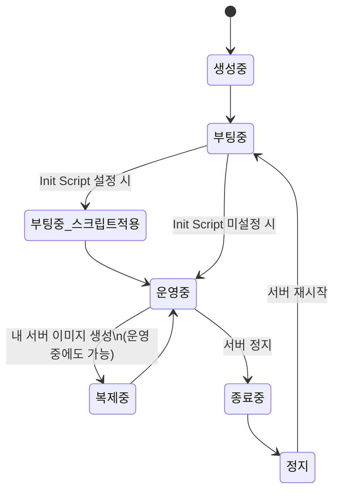
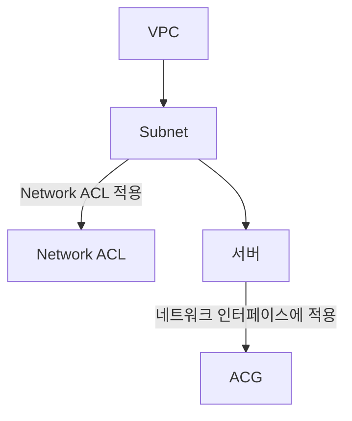

# 📘 NCP 강의 정리 — 2강. 컴퓨트(Compute) 상품

> 네이버 클라우드 플랫폼(NCP) 공인교육 강의 내용을 정리한 노트입니다.

---

## 📑 목차

1. [컴퓨트 상품 개요](#1-컴퓨트-상품-개요)
2. [서버 스펙 및 타입](#2-서버-스펙-및-타입)
3. [요금 구조](#3-요금-구조)
4. [서버 생성 시 선택 항목 & 서버 상태 값 변화](#4-서버-생성-시-선택-항목--서버-상태-값-변화)
5. [서버 운영(오퍼레이션) 기능](#5-서버-운영오퍼레이션-기능)
6. [스토리지 오퍼레이션 (Xen vs KVM)](#6-스토리지-오퍼레이션-xen-vs-kvm)
7. [서버 이미지 (내 서버 이미지)](#7-서버-이미지-내-서버-이미지)
8. [네트워크 관련 기능](#8-네트워크-관련-기능)
9. [🧪 실습(Lab) 절차 요약](#9-실습lab-절차-요약)
10. [🔑 핵심 암기 포인트 (시험 대비)](#10-핵심-암기-포인트-시험-대비)

---

## 1. 컴퓨트 상품 개요

**컴퓨트(Compute) 상품**은 NCP 상에서 **서버를 생성하고 관리**할 수 있는 상품 카테고리입니다. 일반적인 VM 서버 외에도 아래와 같은 고사양 서버 타입을 제공합니다.

| 서버 타입 | 특징 |
|---|---|
| **일반 서버(VM)** | 하이퍼바이저 위에서 동작하는 일반적인 가상 서버 |
| **베어메탈(Bare Metal) 서버** | 가상화 엔진(하이퍼바이저) 없이 제공되는 **클라우드 상의 물리 서버** |
| **GPU 서버** | 머신러닝 등 **병렬 연산**에 최적화된 GPU 카드 기반 서버 |

제공 OS: **CentOS, Rocky Linux, Ubuntu, Windows** 등

> 💡 각 서버 타입의 상세 내용은 아래 [2장](#2-서버-스펙-및-타입)에서 이어집니다.

---

## 2. 서버 스펙 및 타입

### 2.1 일반 서버(VM) 스펙 구분

일반 VM 서버는 **CPU와 메모리의 비율**에 따라 아래와 같이 구분됩니다.

| 서버 타입 | CPU : 메모리 비율 | 적합한 워크로드 |
|---|:---:|---|
| **Standard (표준)** | 1 : 4 | 범용적인 워크로드 |
| **High CPU** | 1 : 2 | 연산 집약적 워크로드 (모델링, 게임 서버 등) |
| **High Memory** | 1 : 8 | 메모리 집약적 워크로드 |
| **CPU Intensive** | (인텔과 협업한 고성능 CPU 탑재) | 머신러닝·딥러닝 등 대량 연산 처리 |

> 💡 **CPU Intensive** 서버는 네이버 클라우드와 **인텔이 협업**하여 만든 서버 타입으로, 고성능 CPU를 탑재하여 대량 연산이 필요한 ML/DL 학습·추론 워크로드에 적합합니다.

### 2.2 베어메탈(Bare Metal) 서버

| 항목 | 내용 |
|---|---|
| 정의 | 하이퍼바이저 없이 **물리 리소스 위에 OS가 직접 설치**되어 제공되는 클라우드 상의 물리 서버 |
| 사용 시나리오 | 다른 VM의 리소스 사용으로 인한 **간섭(Noisy Neighbor) 현상**을 피하고 싶을 때, 성능에 민감한 서비스를 안정적으로 운영하고 싶을 때 |
| 디스크 구성 | **RAID 1+0** 또는 **RAID 5** 중 선택 |
| 제공 OS | CentOS, Oracle Linux, Red Hat, Windows |
| **사용 불가 기능** | 내 서버 이미지, 스냅샷, 추가 블록 스토리지 |
| 요금 | **정지 상태에서도 표준 요금 과금** |

> 💡 **간섭(Noisy Neighbor) 현상이란?** 일반 VM은 하나의 물리 자원을 여러 VM이 공유하는 구조이기 때문에, 특정 VM이 리소스를 과도하게 점유하면 같은 물리 서버에 있는 다른 VM의 성능에 영향을 줄 수 있습니다. 베어메탈은 물리 서버를 통째로 사용하므로 이런 현상에서 자유롭습니다.
>
> 💡 **RAID 1+0 vs RAID 5**: RAID 1+0(미러링+스트라이핑)은 속도와 안정성이 모두 우수하지만 사용 가능 용량이 절반으로 줄어들고, RAID 5(패리티 분산)는 상대적으로 저장 효율이 높지만 쓰기 성능이 RAID 1+0보다 낮습니다.

### 2.3 GPU 서버

| 항목 | 내용 |
|---|---|
| 정의 | **병렬 처리에 최적화된 GPU**가 장착된 서버 |
| 제공 모델 | **NVIDIA T4, V100, A100** 등 |
| 가상화 방식 | **패스스루(Passthrough)** 방식 (GRID 기술 아님) |
| 최대 카드 수 (예시) | T4: 최대 **2장** / V100: 최대 **4장** (모델별로 상이) |
| 제공 OS | GPU 모델별로 지원 OS 상이 |
| 요금 | **정지 상태에서도 전체 서버 요금 과금** (공식 문서 확인) |
| 참고 | KVM 기반 GPU 서버는 스펙 변경 불가 / GPU 서버 ↔ 일반 서버 간 직접 전환 불가 (서버 이미지 경유 필요) |

> 💡 **패스스루(Passthrough) vs GRID**: 패스스루는 GPU 카드 전체(혹은 물리적 단위)를 하나의 VM에 온전히 할당하는 방식이고, GRID는 하나의 물리 GPU를 여러 VM이 가상으로 나누어 쓰는 방식입니다. NCP GPU 서버는 패스스루 방식이므로 GPU 성능을 VM이 온전히 사용할 수 있습니다.

---

## 3. 요금 구조

NCP 컴퓨트 상품의 요금은 다음 3가지 항목이 **합산**되어 청구됩니다.

```
컴퓨트 상품 요금 = 컴퓨팅 리소스 요금 + 네트워크 사용료 + 스토리지 요금
```

서버를 **정지**했을 때 요금이 발생하는 방식은 서버 타입에 따라 다릅니다.

| 구분 | 정지 시 과금 방식 |
|---|---|
| **Standard, High CPU, High Memory, CPU Intensive** (일반 VM) | 컴퓨팅·네트워크 요금은 미발생, **스토리지 요금만 발생** |
| **GPU 서버, 베어메탈 서버** | 정지 상태에서도 **표준 요금(전체 요금) 과금** |

> ⚠️ GPU·베어메탈 서버는 "정지 = 과금 중단"이 아니라는 점에 유의해야 합니다. 시험/실무에서 자주 헷갈리는 포인트입니다.

### 스토리지 타입 (부팅 디스크)

| 타입 | 특징 |
|---|---|
| **SSD** | **최대 IOPS 보장** |
| **HDD** | IOPS 보장 **없음** |

---

## 4. 서버 생성 시 선택 항목 & 서버 상태 값 변화

### 4.1 서버 생성 시 주요 선택 항목

서버 생성 시 아래 순서로 주요 항목을 선택하게 됩니다.

1. **리전(Region)** 선택
2. **VPC / 서브넷** 선택 (네트워크 배치 위치)
3. **부팅 디스크 타입** 선택 (SSD / HDD)
4. **서버 이미지** 선택 — ① OS만 설치된 이미지, ② OS + DB/애플리케이션이 사전 설치된 이미지 중 선택
5. **서버 세대(Generation)** 선택 — Generation 1 / Generation 2 등
6. **서버 타입** 선택 — Standard / High CPU / High Memory / CPU Intensive 등

> 💡 **서버 세대(Generation)와 하이퍼바이저의 관계 (공식 문서 확인)**: NCP 공식 문서 기준으로 **1세대(g1)·2세대(g2) 서버는 XEN 하이퍼바이저 기반**이며, **3세대(g3) 서버는 KVM 하이퍼바이저 기반**입니다. 하이퍼바이저가 다른 리소스(서버, 스토리지, 스냅샷, 서버 이미지)끼리는 서로 호환되지 않으므로, 세대 간 이미지/스토리지를 섞어 쓸 수 없다는 점을 기억해 두세요.

### 4.2 서버 상태 값 변화



- **생성중 → 부팅중** → (Init Script 설정 시) **Init Script 적용** → **운영중**
- **운영중 → 종료중(정지 명령) → 정지**
- **정지 → 재시작 → 부팅중 → 운영중**
- **운영중 상태에서도** 내 서버 이미지 생성 시 잠시 **복제중** 상태로 전환 (VPC 환경 기준)

---

## 5. 서버 운영(오퍼레이션) 기능

서버를 운영하면서 사용할 수 있는 주요 기능들입니다.

| 기능 | 설명 |
|---|---|
| **서버 스펙 변경** | 서버를 **정지**시킨 후 원하는 스펙(CPU/메모리 비율 등)으로 변경 |
| **내 서버 이미지** | 현재 운영 중인 서버 상태를 그대로 캡처(스냅샷처럼)하는 기능. VPC 환경에서는 운영 중 상태에서도 생성 가능 (`서버 메뉴 > 서버 이미지`에서 확인) |
| **유사 서버 생성** | 현재 서버와 **동일한 스펙**의 서버를 생성 (❗ 데이터는 복제하지 않고 **스펙·요금제·ACG 정보 등 설정값만** 그대로 적용) |
| **추가 블록 스토리지** | 서버에 스토리지를 추가로 부착 (세부 제한은 [6장](#6-스토리지-오퍼레이션-xen-vs-kvm) 참고) |
| **반납 보호 설정** | 실수로 서버가 반납(삭제)되지 않도록 보호하는 기능 |
| **상세 모니터링** | Cloud Insight 서비스와 연계한 모니터링 설정 |
| **서버 이름 변경** | ⚠️ **콘솔상에 보이는 이름만 변경**되며, 실제 서버의 **호스트네임은 변경되지 않음** |
| **인증키 변경(재발급)** | 인증키 분실 시 재발급 가능. 재발급 시 **가입 이메일로 인증 절차**를 거쳐야 함 |

> 💡 강의에서는 "네 가지"라고 언급했지만 실제로는 위와 같이 여러 세부 기능이 소개되었습니다. 크게 묶으면 **① 스펙/설정 변경(스펙 변경, 이름 변경, 인증키 변경) ② 복제/이미지(내 서버 이미지, 유사 서버) ③ 스토리지 확장(추가 블록 스토리지) ④ 보호·모니터링(반납 보호, 상세 모니터링)** 4개 카테고리로 이해하면 기억하기 쉽습니다.

---

## 6. 스토리지 오퍼레이션 (Xen vs KVM)

서버가 어떤 **하이퍼바이저(세대)** 기반이냐에 따라 스토리지 관련 스펙이 달라집니다.

| 구분 | **Xen 기반 (1·2세대)** | **KVM 기반 (3세대)** |
|---|---|---|
| **기본 OS 영역 크기** | 고정 — Linux **50GB**, Windows **100GB** (변경 불가) | 가변 — Linux **10GB~2TB**, Windows **30GB~2TB** (생성 시 지정 가능) |
| **추가 블록 스토리지 최대 크기** | 10GB ~ **2TB** | 10GB ~ **16TB** (공식 문서 기준) |
| **추가 블록 스토리지 최대 개수** | 서버 1대당 최대 **15개** | 서버 1대당 최대 **20개** |
| **스냅샷** | **전체 스냅샷 + 증분(Incremental) 스냅샷** 모두 지원 (증분 스냅샷은 순서에 따라 depth 표기) | **전체 스냅샷만 지원** (증분 스냅샷 미지원) |
| **볼륨 타입** | SSD, HDD | (공식 문서 기준) FB1/FB2, CB1/CB2 |

- **스냅샷 활용**: OS 영역/추가 블록 스토리지에 문제가 생겼을 때, 스냅샷을 떠서 그 스냅샷으로 새로운 추가 블록 스토리지를 만들어 **복구**할 수 있습니다.

> 💡 강의에서 "젠(Xen) 기반"과 "KVM 기반"이라는 표현이 반복적으로 등장하는데, 이는 곧 **서버 세대(1·2세대=Xen, 3세대=KVM)** 차이를 의미합니다. 시험에서는 숫자(50GB/100GB, 15개/20개, 2TB/16TB)를 정확히 구분하는 문제가 나올 수 있으니 표로 비교해서 암기하는 것이 좋습니다.

---

## 7. 서버 이미지 (내 서버 이미지)

| 항목 | 내용 |
|---|---|
| 정의 | 서버 + **서버에 할당된 추가 블록 스토리지까지 전부** 이미지로 생성 |
| 소요 시간 | 추가 블록 스토리지 용량이 클수록 이미지 생성 시간이 **오래 걸림** |
| 팁 | 추가 블록 스토리지가 크거나 많을 경우, **추가 블록 스토리지를 해제한 뒤 OS 영역만 이미지화**하고, 추가 블록 스토리지는 **스냅샷**으로 별도 관리하는 것을 권장 |
| 생성 시점 | **VPC 환경**에서는 서버가 **운영 중인 상태에서도** 생성 가능 |
| 공유 기능 | 생성한 내 서버 이미지를 **다른 NCP 계정과 공유** 가능 (공유할 계정 등록) |
| 활용 예 | 백업/복구 용도, 이미지를 공유해 동일한 환경의 새 서버를 만들 때 |
| Classic 플랫폼 팁 | Classic 플랫폼은 서버 생성 후 **ACG를 직접 수정할 수 없기 때문에**, 서버 이미지를 생성한 뒤 그 이미지로 새 서버를 만들면서 **원하는 ACG를 새로 적용**하는 방식으로 우회 |

---

## 8. 네트워크 관련 기능

### 8.1 퍼블릭 IP (공인 IP)

- 서버 접속 방법: **공인 IP 접속** 또는 **SSL VPN 접속**
- VPC 환경에서 퍼블릭 IP는 **리전에 종속**되며 **Zone 구분 없이** 사용 가능
- 서버 생성 **후**에 별도로 부여하거나, 서버 생성 시 **운영 중 상태가 되면 자동으로 할당**되도록 설정 가능
- 공인 IP는 **서버에 종속되지 않고 "매핑"되는 개념** — 즉 IP 자체를 서버에 연결/해제할 수 있음
- 서버 개수만큼 공인 IP 할당/사용 가능

### 8.2 네트워크 인터페이스(NIC)

| 항목 | 제한 |
|---|---|
| 서버 1대당 네트워크 인터페이스 | 최대 **3개** |
| NIC 1개당 Secondary IP | 최대 **5개** |
| NIC 1개당 총 IP 개수 | Primary 1개 + Secondary 5개 = **최대 6개** |

- Secondary IP를 콘솔에서 부여한 후에는, **서버에 접속하여 네트워크 스크립트를 직접 작성/적용**해야 실제로 사용 가능
- **HA(고가용성) 구성**이 필요하다면 Secondary IP + **Keepalived** 조합으로 직접 구현 가능

> 💡 **Keepalived란?** 리눅스에서 VRRP(가상 라우터 이중화 프로토콜)를 구현하는 오픈소스 소프트웨어로, 두 대의 서버 중 하나에 장애가 생기면 나머지 서버가 가상 IP(Secondary IP)를 넘겨받아 서비스를 이어가도록(Failover) 해줍니다.

### 8.3 ACG (Access Control Group)



| 항목 | 내용 |
|---|---|
| 정의 | 서버의 **방화벽 역할**. 인바운드/아웃바운드 트래픽을 제어 |
| 약자 | **A**ccess **C**ontrol **G**roup |
| 적용 단위 | 서버의 **네트워크 인터페이스** |
| 기본 정책 | 규칙(Rule)이 없으면 **모두 차단(Deny)** — 명시적으로 허용 규칙을 추가해야 통신 가능 |
| VPC당 최대 개수 | **500개** |
| NIC(네트워크 인터페이스)당 적용 개수 | 최대 **3개** |
| 인바운드 규칙 최대 개수 | **50개** |
| 아웃바운드 규칙 최대 개수 | **50개** |

**주요 프로토콜**

| 프로토콜 | 설명 |
|---|---|
| **TCP** | 인터넷 상 컴퓨터들 사이에 데이터를 메시지 형태로 전송하기 위한 프로토콜 |
| **UDP** | 단문 메시지 교환 용도로 사용하는 프로토콜 |
| **ICMP** | 호스트-인터넷 게이트웨이 간 IP 패킷 전송 중 발생한 오류를 진단하는 프로토콜 |

> 💡 **Network ACL vs ACG**: 둘 다 트래픽을 통제하지만, **Network ACL은 서브넷 단위**로 적용되고 **ACG는 서버(네트워크 인터페이스) 단위**로 적용됩니다. Network ACL은 기본적으로 모두 허용(룰 없으면 Allow)인 반면, **ACG는 기본적으로 모두 차단(룰 없으면 Deny)** 이라는 차이를 기억해 두면 좋습니다.

---

## 9. 🧪 실습(Lab) 절차 요약

강의 후반부는 실제 콘솔 실습으로 진행되었습니다. 핵심 절차만 순서대로 정리했습니다.

### Lab 1. 리눅스 서버 생성 + Cloud DB 연동 + CLA 로그 수집

1. **VPC 생성** (네트워킹 카테고리) — 이름 지정, IP 대역(10.0.0.0/16 등) 설정
2. **Network ACL 생성** 후 **서브넷(퍼블릭 서브넷)** 생성 — VPC, Zone, 인터넷 게이트웨이 사용 여부 지정
3. **ACG 생성** — 인바운드(ICMP 전체 허용, TCP 전체 허용), 아웃바운드(전체 허용) 규칙 추가 *(실습 목적의 전체 오픈 — 운영 환경에서는 필요한 포트만 최소 허용 권장)*
4. **Init Script 생성** — 리눅스 서버용, 아파치/PHP 설치 + 테스트 페이지 다운로드 스크립트 작성
5. **서버 생성** — CentOS 7.3, VPC/퍼블릭 서브넷 배치, Standard 타입(vCPU 2 / 8GB), 사설 IP 직접 지정, 위에서 만든 Init Script 적용, 인증키 신규 생성, ACG 적용
6. **퍼블릭 IP 신청 및 할당** → 공인 IP로 접속해 Init Script 결과(웹 페이지) 확인
7. **SSH 보안 강화**: 신규 계정(예: student) 생성 → `/etc/ssh/sshd_config`에서 `PermitRootLogin no`로 변경 → SSHD 서비스 재시작 → 이후 접속은 일반 계정 로그인 후 `su -` 로 전환
8. **CLA(Cloud Log Analytics) 설정**: Management & Governance 카테고리에서 이용 설정 → 대상 서버 선택 후 수집 설정(템플릿 또는 커스텀 로그 경로 지정) → 안내되는 **에이전트 설치 명령어**를 서버에서 실행 → 설정 완료 확인
9. **Cloud DB for MySQL 생성**: 엔진 버전 선택 → (필요 시 멀티존 HA 옵션) → VPC/서브넷 지정 → DB 서버 타입(vCPU 2 / 8GB), 스토리지(HDD) → DB/서비스 이름 지정 → 접속 유저·비밀번호·포트(3306)·기본 DB명 설정 → 백업 주기 설정 → 생성
10. **DB 부가 설정**: DB 유저 추가(DB Management 메뉴), 신규 데이터베이스 추가
11. **DB용 ACG 오픈**: Cloud DB가 자동 생성한 ACG에 **TCP 3306 인바운드/아웃바운드 허용 규칙 추가** (기본은 자기 자신만 허용되어 있어 서버 → DB 접근이 차단된 상태)
12. **애플리케이션 연동**: 서버 내 PHP 설정 파일에 **DB 프라이빗 도메인**, **API 인증키(Access Key/Secret Key, 마이페이지 > 인증키 관리에서 확인)** 입력 → SQL 스크립트 실행하여 테이블 생성 확인

### Lab 2. Windows 서버 생성

- 부팅 디스크 타입을 **100GB**로 선택해야 Windows 이미지 목록이 노출됨 (Windows Server 2016 등 선택)
- VPC/서브넷, 서버 타입(Standard, vCPU 2/8GB), 사설 IP, 인증키, 기존 ACG 적용 후 생성

### Lab 3. 내 서버 이미지 생성 + 추가 블록 스토리지(리눅스, LVM)

- **서버 관리 및 설정 변경 > 내 서버 이미지 생성**으로 이미지 생성
- 추가 블록 스토리지 3개 생성(HDD, 각 10GB) → 그중 1개는 **단순 마운트**, 나머지 2개는 **LVM으로 결합**
- **단순 마운트**: `fdisk` → 파티션 생성(n, p) → 포맷 → `mount`
- **LVM 결합**: 두 파티션 모두 `fdisk`에서 타입을 **8e(Linux LVM)**로 변경 → `pvcreate` → `vgcreate`(볼륨그룹 생성) → `lvcreate`(논리 볼륨 생성) → 포맷 → `mount`

### Lab 4. Windows 서버 스토리지 (디스크 관리, Spanned Volume)

- 추가 디스크 3개 생성(HDD, 각 10GB) → 원격 데스크톱 접속 → **디스크 관리(Disk Management)** 에서 초기화(Initialize)
- 디스크 1개는 **새 단순 볼륨(New Simple Volume)** 마법사로 드라이브 매핑
- 나머지 2개는 **새 스팬 볼륨(New Spanned Volume)** 마법사로 결합하여 하나의 드라이브로 인식

### Lab 5. 리눅스 스토리지 용량 증설

1. 대상 디스크 **언마운트**
2. `growpart` 유틸리티 설치 (`cloud-utils-growpart`)
3. 콘솔에서 스토리지를 **서버에서 연결 해제** (언마운트 또는 서버 정지 상태에서만 가능) → 콘솔에서 **용량 변경**(예: 10GB → 20GB) → 다시 서버에 **연결**
4. 서버에서 `growpart`로 **파티션 확장** → 파일시스템 확장 명령 실행(리사이즈) → 다시 **마운트**하여 확장된 용량 확인

> 💡 스토리지 용량을 늘려도 OS가 자동으로 인식하지 못하기 때문에, **① 콘솔에서 볼륨 용량 증설 → ② 파티션 확장(growpart) → ③ 파일시스템 확장(resize2fs/xfs_growfs 등)** 3단계를 순서대로 거쳐야 실제로 늘어난 용량을 사용할 수 있습니다.

### Lab 6. Windows 스토리지 용량 증설

1. 서버 **정지** → 콘솔에서 스토리지 **연결 해제**
2. 콘솔에서 스토리지 **용량 증설**(예: 10GB → 20GB) → 다시 서버에 **연결** → 서버 **시작(재기동)**
3. 원격 데스크톱 접속 → **디스크 관리**에서 해당 볼륨에 **Extend Volume(볼륨 확장)** 마법사 실행 → 늘어난 용량 반영

### Lab 7. 내 서버 이미지 기반 서버 생성

- **서버 이미지** 메뉴에서 기존에 생성해둔 이미지 선택 → **서버 생성** → VPC/서브넷/스토리지 타입/서버 타입 지정 → 사설 IP 자동 할당 → 기존 인증키·ACG 재사용 → 생성

---

## 10. 🔑 핵심 암기 포인트 (시험 대비)

- [ ] 컴퓨트 요금 = **컴퓨팅 리소스 + 네트워크 사용료 + 스토리지 요금**
- [ ] 정지 시 **스토리지 요금만 발생**: Standard, High CPU, High Memory, CPU Intensive
- [ ] 정지 시에도 **표준(전체) 요금 과금**: **GPU 서버, 베어메탈 서버**
- [ ] 스토리지 타입: **SSD(최대 IOPS 보장) / HDD(IOPS 보장 없음)**
- [ ] 서버 스펙별 CPU:메모리 비율 — **Standard 1:4 / High CPU 1:2 / High Memory 1:8**
- [ ] **베어메탈**: 하이퍼바이저 없음, RAID 1+0/RAID5 선택, **서버 이미지·스냅샷·추가 스토리지 사용 불가**
- [ ] **GPU 서버**: 패스스루 방식(GRID 아님), 모델별 최대 카드 수 상이
- [ ] **서버 세대·하이퍼바이저**: **1·2세대 = Xen** / **3세대 = KVM** (하이퍼바이저 다르면 리소스 호환 불가)
- [ ] **Xen vs KVM 스토리지**: OS 영역(Xen 고정 50/100GB vs KVM 가변 10GB~2TB/30GB~2TB), 추가 스토리지(Xen 최대 2TB·15개 vs KVM 최대 16TB·20개)
- [ ] **스냅샷**: Xen(전체+증분) vs **KVM(전체만)**
- [ ] **유사 서버**: 데이터는 복제 X, **스펙/설정만** 복제
- [ ] **서버 이름 변경**: 콘솔 이름만 변경, **호스트네임은 그대로**
- [ ] **네트워크 인터페이스**: 서버당 최대 **3개**, NIC당 Secondary IP 최대 **5개**(총 6개)
- [ ] **ACG**: 기본 **Deny**(룰 없으면 차단), VPC당 최대 **500개**, NIC당 최대 **3개** 적용, 인바운드·아웃바운드 각 최대 **50개** 룰
- [ ] **Network ACL vs ACG**: ACL은 서브넷 단위·기본 Allow / ACG는 서버(NIC) 단위·기본 Deny
- [ ] 스토리지 증설 3단계: **콘솔 용량 증설 → 파티션 확장(growpart) → 파일시스템 확장**

---
