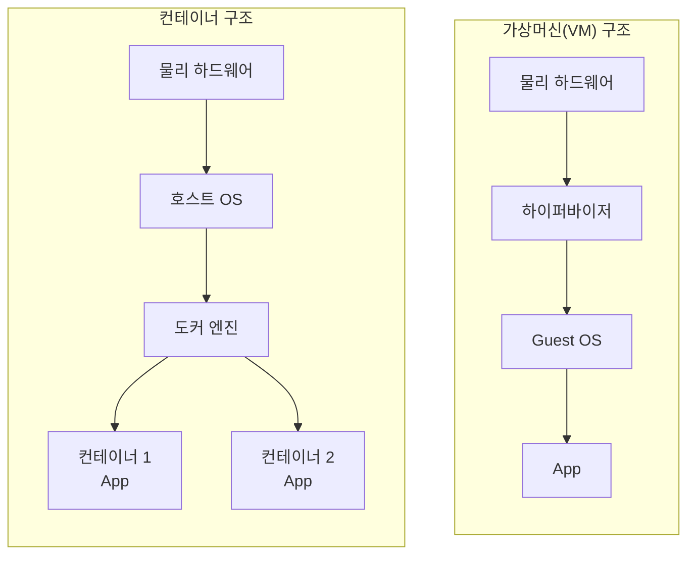
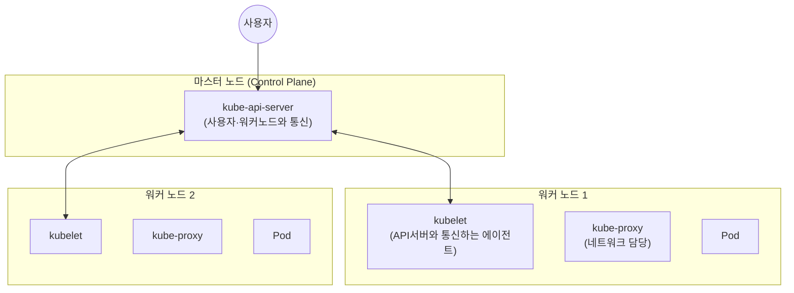
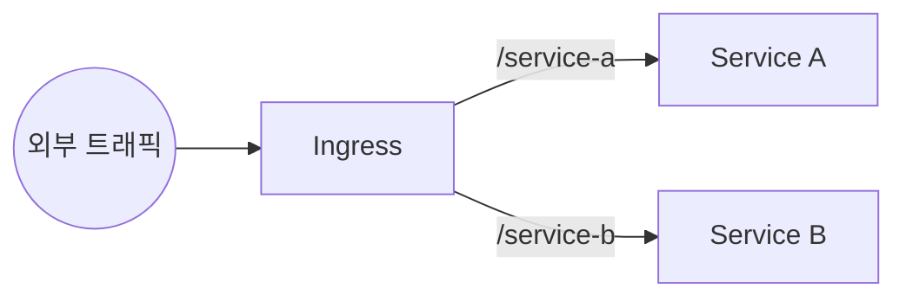
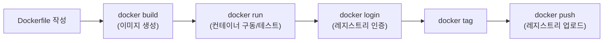
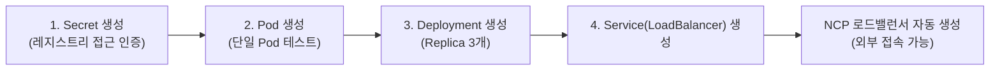

# 📘 NCP 강의 정리 — 3강. 컨테이너(Container) 상품

> 네이버 클라우드 플랫폼(NCP) Professional 과정 **컨테이너** 과목(Docker, Container Registry, Kubernetes, NKS)을 정리한 노트입니다.

---

## 📑 목차

1. [Docker 기본 개념](#1-docker-기본-개념)
2. [컨테이너 vs 가상머신(VM) 비교](#2-컨테이너-vs-가상머신vm-비교)
3. [컨테이너 레지스트리 (Container Registry)](#3-컨테이너-레지스트리-container-registry)
4. [쿠버네티스(Kubernetes) 핵심 기능](#4-쿠버네티스kubernetes-핵심-기능)
5. [쿠버네티스 아키텍처 (마스터/워커 노드)](#5-쿠버네티스-아키텍처-마스터워커-노드)
6. [쿠버네티스 핵심 오브젝트](#6-쿠버네티스-핵심-오브젝트)
7. [쿠버네티스 모니터링 도구](#7-쿠버네티스-모니터링-도구)
8. [NCP Kubernetes Service (NKS) 특징](#8-ncp-kubernetes-service-nks-특징)
9. [🧪 실습 1: 환경 준비 (서브넷 / 레지스트리 / Docker 빌드·푸시)](#9-실습-1-환경-준비-서브넷--레지스트리--docker-빌드푸시)
10. [🧪 실습 2: NKS 클러스터 생성 & 접속 설정](#10-실습-2-nks-클러스터-생성--접속-설정)
11. [🧪 실습 3: Pod / Deployment / Service 배포](#11-실습-3-pod--deployment--service-배포)
12. [🔑 핵심 암기 포인트 (시험 대비)](#12-핵심-암기-포인트-시험-대비)

---

## 1. Docker 기본 개념

| 항목 | 내용 |
|---|---|
| 정의 | **컨테이너 환경을 운영할 수 있는 오픈소스 플랫폼** |
| 기반 기술 | 초기 도커는 리눅스 커널의 **네임스페이스(Namespace)**, **컨트롤 그룹(cgroup)** 기능을 활용해 컨테이너 환경을 구현 |
| **Dockerfile** | 컨테이너 이미지를 어떻게 만들지 **정의(description)** 하는 파일. 예: 근간(Base) 이미지를 Ubuntu로 지정 → 아파치 설치 → index.html 지정 |
| **docker build** | Dockerfile을 바탕으로 실제 **이미지**를 생성하는 명령 |
| 이미지 저장/공유 | 생성된 이미지는 **컨테이너 레지스트리**(NCP) 또는 **Docker Hub**(도커 공식)에 저장·공유 |

### 레이어드 이미지(Layered Image)

- 도커 이미지는 **레이어(층) 구조**로 구성됨 (예: Ubuntu 이미지 레이어 위에 Apache 설치 레이어가 쌓이는 구조)
- 동일한 베이스 이미지(예: Ubuntu)를 사용하는 여러 이미지가 있어도, **한 번 다운로드한 레이어는 공유·재사용**되므로 **효율적인 이미지 관리**가 가능
- 특정 레이어에 변경 사항이 생기면 **그 레이어만** 다시 반영하면 됨

> 💡 레이어드 이미지 덕분에 여러 애플리케이션 이미지가 같은 OS 베이스를 쓰더라도 **디스크 공간과 다운로드 시간을 절약**할 수 있습니다. Git의 커밋처럼 "변경분만 쌓는다"는 개념과 유사합니다.

---

## 2. 컨테이너 vs 가상머신(VM) 비교

| 구분 | **가상머신 (VM)** | **컨테이너** |
|---|---|---|
| 구동 기반 | **하이퍼바이저** | **도커 엔진** |
| OS 필요 여부 | Guest OS **필요** | OS **불필요** — 호스트 OS의 **커널을 공유** |
| 크기/속도 | 상대적으로 무겁고 느림 | **경량화**되어 있어 **빠름** |
| 실행 환경 제약 | 하이퍼바이저 필요 | **도커 엔진만 설치되어 있으면 어디서든** 실행 가능 |

---

## 3. 컨테이너 레지스트리 (Container Registry)

| 항목 | 내용 |
|---|---|
| 정의 | 보유한 **컨테이너 이미지를 저장·관리**하는 NCP 서비스 |
| 접근 엔드포인트 | **퍼블릭 엔드포인트**(외부에서 접근) / **프라이빗 엔드포인트**(NCP 내부/VPC에서 접근) |
| 기반 스토리지 | **오브젝트 스토리지**를 근간으로 함 → 용량·확장성 측면에서 유리 |
| 권한 관리 | **서브 어카운트(Sub Account)** 기능으로 계정별 접근 권한 관리 가능 |
| 보안 기능 | **컨테이너 취약점 분석** — 이미지의 취약점을 심각도별로 분류, 스캔 결과 기반으로 보안 강화 가능 |

---

## 4. 쿠버네티스(Kubernetes) 핵심 기능

| 기능 | 설명 |
|---|---|
| **자동 스케줄링** | 워커 노드들의 **가용성을 파악**해 요청받은 컨테이너(Pod)를 적절한 워커 노드에 자동 배치 |
| **스토리지 오케스트레이션** | NAS, 블록 스토리지 등 **외부 스토리지를 할당·마운트** |
| **시크릿 & 컨피그 관리** | 환경변수를 별도 파일로 관리하거나, ID/비밀번호 등 민감정보를 **Secret 객체**로 별도 관리 |
| **Pod 레벨 수평 확장(스케일 아웃)** | CPU 사용량 등 조건에 따라 **Pod 개수를 자동으로 확장** |
| **서비스 디스커버리 & 로드밸런싱** | **Service 객체**를 통해 컨테이너의 IP 변경에 관계없이 안정적으로 트래픽 라우팅 |
| **셀프 힐링(Self-Healing)** | 사용자가 정의한 **Replica 개수**를 지속적으로 유지 — 장애로 Pod가 죽으면 자동으로 새 Pod 생성 |
| **롤아웃 / 롤백** | 새 버전 애플리케이션 배포 시 편리한 배포·복구 기능 제공 |

> 💡 **왜 Service 객체가 필요할까?** 컨테이너(Pod)는 재시작될 때마다 **IP가 바뀔 수 있습니다.** 만약 클라이언트가 Pod의 IP를 직접 바라보고 있다면, Pod가 재생성될 때마다 통신이 끊깁니다. Service 객체가 Pod들 앞단에서 **고정된 진입점** 역할을 해주기 때문에, Pod가 죽었다 살아나도 서비스는 끊기지 않습니다.

---

## 5. 쿠버네티스 아키텍처 (마스터/워커 노드)

| 구성 요소 | 역할 |
|---|---|
| **마스터 노드 (Control Plane)** | **kube-api-server**가 위치 — 사용자와의 통신, 워커 노드와의 통신을 총괄 |
| **워커 노드** | 실제 **컨테이너(Pod)가 구동되는 위치** |
| **kubelet** | 워커 노드에 설치되며, **kube-api-server와 통신하는 에이전트** |
| **kube-proxy** | 워커 노드의 **네트워크를 담당** |

---

## 6. 쿠버네티스 핵심 오브젝트

### 6.1 Pod

- 쿠버네티스의 **가장 작은 배포 단위** (쿠버네티스에서는 "컨테이너"보다 **"Pod"** 라는 표현을 사용)
- **하나의 컨테이너**로 구성될 수도, **여러 개의 컨테이너 집합**으로 구성될 수도 있음
- 여러 컨테이너가 **같은 리소스를 공유**해야 하는 경우 하나의 Pod로 묶어서 배포

### 6.2 Deployment

- **Replica(복제본) 개수**와 **Pod가 사용할 근간 이미지**를 정의하는 객체
- 쿠버네티스는 **Label(레이블/이름표)** 을 기준으로 "정의된 개수만큼 Pod가 운영되고 있는지"를 지속적으로 모니터링 → **셀프 힐링**의 실제 구현체

### 6.3 DaemonSet

- 특정 Pod가 **모든 워커 노드**(기본 동작) 또는 **특정 워커 노드**(`nodeSelector`로 지정)에서 실행되도록 하는 객체
- 예: 모니터링 에이전트처럼 **모든 노드에 반드시 하나씩** 떠 있어야 하는 워크로드에 사용

### 6.4 Service (3가지 타입)

| 타입 | 설명 |
|---|---|
| **ClusterIP** | **클러스터 내부에서만** 접근 가능 |
| **LoadBalancer** | **외부의 요청**을 받아 내부 Pod로 전달 — NCP의 **로드밸런서**와 연동되어 실제 로드밸런서 리소스가 생성됨 |
| **NodePort** | 특정 **포트로 포트포워딩**하여 연결된 Pod로 트래픽 전달 |

### 6.5 Ingress

- **외부 트래픽을 내부의 여러 Service로 라우팅**하는 객체
- **호스트(Host) 기반** 또는 **URL 경로(Path) 기반** 라우팅 규칙 지원

> 💡 **Service vs Ingress**: Service(LoadBalancer 타입)는 서비스 1개당 로드밸런서 1개가 필요할 수 있어 여러 서비스를 운영하면 로드밸런서도 여러 개 필요할 수 있습니다. Ingress는 **하나의 진입점에서 URL/호스트 기반으로 여러 서비스에 트래픽을 분배**할 수 있어 더 효율적인 구조를 만들 수 있습니다.

---

## 7. 쿠버네티스 모니터링 도구

| 도구 | 설명 |
|---|---|
| **Grafana** | 널리 쓰이는 **오픈소스 시각화 모니터링 툴**. 데이터 소스를 정의하고 쿼리를 통해 동적으로 데이터를 가져와 시각화. 임계값 초과 시 **알람 발송** 가능 |
| **Prometheus** | 오픈소스 모니터링 시스템. 특히 **쿠버네티스의 대표적인 메인 모니터링 시스템**으로 널리 사용됨 |
| **NKS 자체 대시보드** | NCP Kubernetes Service는 **Grafana 연동** + **쿠버네티스 자체 제공 대시보드**가 기본 연계되어 있어, 클러스터 생성 후 바로 모니터링 대시보드 확인 가능 |

---

## 8. NCP Kubernetes Service (NKS) 특징

| 항목 | 내용 |
|---|---|
| 지원 서버 스펙 | Standard, CPU Intensive, GPU 등 **다양한 서버 스펙** 선택 가능 (워커 노드) |
| 마스터 노드 관리 | **NCP가 관리 · Hidden 처리** → 사용자에게 노출되지 않으며, **내부 HA 구성**으로 고가용성이 확보되어 있음 → 사용자는 **워커 노드만 관리**하면 됨 |
| 서비스 연동 | **NAS, 블록 스토리지, 컨테이너 레지스트리, 로드밸런서** 등 다양한 NCP 서비스와 연동 |
| 제공 형태 | **완전 관리형 서비스** — 클릭 몇 번으로 클러스터 구성 가능 |

> 💡 **직접 설치 vs 관리형(NKS) 비교**: 쿠버네티스를 직접 설치하려면 마스터/워커 노드 설정, 설치 도구 선택, 클러스터 배포, 모니터링 도구 설치 등을 **모두 직접** 해야 합니다. NKS를 사용하면 이 모든 과정(모니터링 도구 설치 포함)이 자동화되어, **워커 노드 스펙과 개수만 지정**하면 클러스터가 완성됩니다.

---

## 9. 🧪 실습 1: 환경 준비 (서브넷 / 레지스트리 / Docker 빌드·푸시)

### 9.1 서브넷 3개 생성 (쿠버네티스 활용 준비)

| 서브넷 | 용도 | 인터넷 게이트웨이 |
|---|---|---|
| 쿠버네티스 전용 서브넷 | 워커 노드 배치용 (**프라이빗**) | N |
| 로드밸런서 전용 서브넷 | K8s Service(LoadBalancer)용 (**프라이빗**) | N |
| NAT 게이트웨이 전용 서브넷 | 프라이빗 서브넷의 아웃바운드 통신용 (**퍼블릭**) | Y |

### 9.2 관리용 서버 준비 & 컨테이너 레지스트리 생성

1. 기존 서버(`LNX-VR1`)에 **kubectl, Docker 설치 스크립트**를 Object Storage에서 다운로드하여 설치
2. **Object Storage 버킷 생성** (컨테이너 레지스트리는 오브젝트 스토리지를 기반으로 하므로 선행 필요)
3. **컨테이너 레지스트리 생성**: 생성한 버킷 선택 → 레지스트리 이름 지정 → 생성

### 9.3 Docker 이미지 빌드 & 컨테이너 구동 & 레지스트리 푸시

1. **Dockerfile** 작성 (예: CentOS 7 기반 + Apache 설치 + 테스트용 웹페이지 구성)
2. **`docker build`**로 이미지 생성 (예: `image_apache`) → **`docker images`** 로 생성 확인
3. **`docker run`** 으로 컨테이너 구동 (백그라운드 모드, 서버 포트 4000 ↔ 컨테이너 80 포트 매핑) → **`docker container ls`** 로 구동 확인 → 공인 IP:4000 접속 테스트
4. **`docker login`**: `docker-server`(=컨테이너 레지스트리의 **퍼블릭 엔드포인트**), `username`(=Access Key), `password`(=Secret Key) 입력
5. **`docker tag`**: 이미지에 `{레지스트리 퍼블릭 엔드포인트}/image_apache:1.0` 형태로 태그 부여
6. **`docker push`**: 레지스트리에 이미지 업로드 → 콘솔의 **이미지 리스트**에서 업로드 확인

---

## 10. 🧪 실습 2: NKS 클러스터 생성 & 접속 설정

### 10.1 쿠버네티스 클러스터 생성

- 클러스터 이름, 버전(예: 1.24.10) 지정
- VPC/가용 존 선택
- **네트워크 타입: Private** 선택 → 미리 만들어둔 **쿠버네티스 전용 서브넷** 자동 매핑
- **로드밸런서 전용 서브넷** 선택
- 최대 노드 수, 로그 수집/반납 보호 여부(실습에서는 미설정) 지정
- **노드 풀** 구성: 서버 이미지(Ubuntu), 서버 타입(Standard vCPU2/메모리 8GB), 노드 수(1대)
- 인증키 선택 → 클러스터 생성 시작

### 10.2 NAT 게이트웨이 & 라우트 테이블 설정

- 네트워크 타입을 **Private**로 만들었기 때문에, 클러스터의 아웃바운드(외부) 통신을 위해서는 **NAT 게이트웨이가 필요**
- **NAT 게이트웨이 생성**: 공인 유형, VPC, NAT 전용 서브넷 지정
- **라우트 테이블 수정**: 프라이빗 서브넷용 라우트 테이블(예: Default Private Table)에 **외부로 나가는 트래픽 → NAT 게이트웨이**로 향하도록 규칙 추가

### 10.3 ncp-iam-authenticator 설정 (관리용 서버에서)

`LNX-VR1` 서버에서 클러스터에 접근하기 위한 절차입니다.

1. **ncp-iam-authenticator** 설치 파일 다운로드 → 실행 권한 부여 → **PATH** 등록 → `--help`로 정상 설치 확인
2. **API 인증 정보 설정**: Access Key, Secret Key, API Gateway 값을 설정
3. **kubeconfig 파일 생성**: 콘솔에서 확인한 **클러스터 UUID** 값을 설정 파일에 반영하여 `~/.ncloud/` 등의 경로에 kubeconfig 구성
4. **접속 테스트**: `kubectl --kubeconfig {경로} get namespaces` 로 네임스페이스 조회 성공 확인
5. 매번 경로를 지정하는 번거로움을 없애기 위해 **`alias`(또는 `KUBECONFIG` 환경변수)** 를 `.bashrc` 등에 등록 → 이후 `kubectl get namespaces` 만으로 접속 가능

> 💡 **ncp-iam-authenticator란?** NCP의 IAM(계정 인증) 체계와 쿠버네티스의 인증 체계를 연결해주는 도구입니다. `kubectl`이 클러스터에 요청을 보낼 때, 이 도구가 NCP의 Access Key/Secret Key를 이용해 "이 사용자가 이 클러스터에 접근할 권한이 있는지"를 확인해주는 역할을 합니다.

---

## 11. 🧪 실습 3: Pod / Deployment / Service 배포

1. **Secret 생성** (`kubectl create secret docker-registry`): 컨테이너 레지스트리 접근용 인증 정보를 담은 Secret 객체 생성
   - `docker-server`: 레지스트리의 **프라이빗 엔드포인트** (VPC 내부에서 접근하므로 Private 사용)
   - `docker-username`: Access Key / `docker-password`: Secret Key / `docker-email`: 사용자 이메일
   - `kubectl get secret` 으로 생성 확인
2. **단일 Pod 생성**: 샘플 YAML(`create-only-pod.yaml`)의 이미지 경로를 본인의 **프라이빗 엔드포인트**로 수정 → `kubectl create -f` 적용 → `kubectl get pod -w`(watch 옵션)로 **Running** 상태 확인
3. **Deployment 생성**: 샘플 YAML(`create-deployment.yaml`)에서 **Replica 3개**로 지정, 이미지 경로 동일하게 수정 → 적용 → Pod **3개가 동시에** 생성되는 것 확인
4. **Service(LoadBalancer 타입) 생성**: 별도 YAML 적용 (이름: `example-service`) → `kubectl get service` 로 생성 확인 → **NCP 콘솔의 로드밸런서 메뉴에도 자동으로 로드밸런서가 생성**된 것 확인
5. 로드밸런서 **도메인으로 접속** → Deployment로 띄운 Pod들이 처리하는 웹 페이지가 정상적으로 노출되는 것을 최종 확인

---

## 12. 🔑 핵심 암기 포인트 (시험 대비)

- [ ] Docker는 리눅스 **네임스페이스·cgroup** 기반으로 시작된 오픈소스 컨테이너 플랫폼
- [ ] **VM = 하이퍼바이저 + Guest OS 필요** / **컨테이너 = 도커 엔진 + 호스트 OS 커널 공유(OS 불필요)** → 컨테이너가 더 경량·고속
- [ ] **레이어드 이미지**: 동일 베이스 레이어는 재사용, 변경된 레이어만 갱신
- [ ] **컨테이너 레지스트리**: 오브젝트 스토리지 기반, **퍼블릭/프라이빗 엔드포인트** 제공, Sub Account로 권한 관리, 취약점 분석 제공
- [ ] 쿠버네티스 마스터 노드 = **Control Plane**(kube-api-server) / 워커 노드 = **kubelet**(에이전트) + **kube-proxy**(네트워크)
- [ ] **Pod**: 최소 배포 단위, 리소스를 공유해야 하는 컨테이너는 하나의 Pod로 묶음
- [ ] **Deployment**: Replica 개수 + 이미지 정의, **Label**로 Pod 상태 모니터링 → 셀프힐링 구현
- [ ] **DaemonSet**: 기본은 모든 워커 노드에 배치, `nodeSelector`로 특정 노드 지정 가능
- [ ] **Service 3종**: **ClusterIP**(내부 전용) / **LoadBalancer**(외부→내부, NCP LB 연동) / **NodePort**(포트포워딩)
- [ ] **Ingress**: 호스트/URL Path 기반으로 외부 트래픽을 여러 Service에 분배
- [ ] 쿠버네티스 모니터링: **Grafana**(시각화), **Prometheus**(K8s 대표 모니터링 시스템)
- [ ] **NKS**: 마스터 노드는 NCP가 관리(Hidden, HA 구성) → 사용자는 **워커 노드만 관리**
- [ ] NKS를 **Private 네트워크 타입**으로 만들면 **NAT 게이트웨이 + 라우트 테이블 설정**이 필수
- [ ] 클러스터 접속에는 **ncp-iam-authenticator**를 이용한 kubeconfig 구성이 필요 (Access Key/Secret Key 기반 인증)
- [ ] 레지스트리 접근용 인증정보는 **Secret(`docker-registry` 타입)** 객체로 생성해서 Pod/Deployment에서 참조

---
