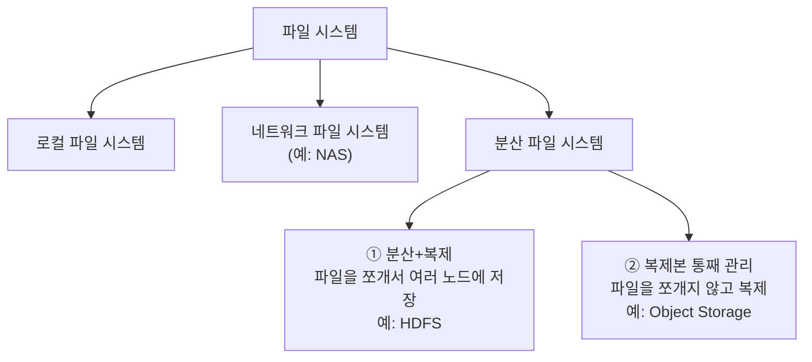
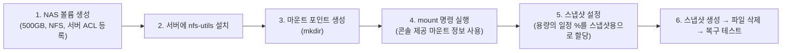

# 📘 NCP 강의 정리 — 4강. 스토리지(Storage) 상품

> 네이버 클라우드 플랫폼(NCP) Professional 과정 **스토리지** 과목(파일 시스템 기초, Object/Archive Storage, Backup, NAS)을 정리한 노트입니다.

---

## 📑 목차

1. [파일 시스템(File System) 기초 — 파일 할당 방식](#1-파일-시스템file-system-기초--파일-할당-방식)
2. [파일 시스템의 종류](#2-파일-시스템의-종류)
3. [오브젝트 스토리지 (Object Storage)](#3-오브젝트-스토리지-object-storage)
4. [아카이브 스토리지 (Archive Storage)](#4-아카이브-스토리지-archive-storage)
5. [백업 서비스 (Backup Service)](#5-백업-서비스-backup-service)
6. [나스(NAS) 스토리지](#6-나스nas-스토리지)
7. [추가 블록 스토리지 vs NAS 비교](#7-추가-블록-스토리지-vs-nas-비교)
8. [🧪 실습: NAS 볼륨 생성 / 마운트 / 스냅샷 복구](#8-실습-nas-볼륨-생성--마운트--스냅샷-복구)
9. [🔑 핵심 암기 포인트 (시험 대비)](#9-핵심-암기-포인트-시험-대비)

---

## 1. 파일 시스템(File System) 기초 — 파일 할당 방식

**파일 시스템**이란 OS에서 저장되는 파일을 관리하는 시스템을 의미합니다. 파일을 디스크에 어떻게 할당(저장)하느냐에 따라 아래와 같이 발전해 왔습니다.

| 방식 | 설명 | 장점 | 단점 |
|---|---|---|---|
| **연속 할당 방식** | 파일의 **시작 위치 + 크기**로 디스크 공간에 **연속적으로** 저장하는 가장 고전적인 방식 | 구조가 단순함 | 파일 삭제 등으로 생긴 **중간의 빈 공간을 활용할 수 없어 저장 공간 낭비**가 심함 |
| **비연속 할당 방식** | 데이터를 비연속적으로 저장하고, 다음 블록의 위치를 **링크(Link) 형태**로 저장 (예: 5번 블록 → 11번 블록 → 16번 블록) | 연속 할당보다 **저장 공간을 효율적으로 사용** | 중간의 **링크 정보가 유실되면 파일 전체에 접근이 불가능**해짐 |
| **색인(인덱스) 할당 방식** | 파일이 사용하는 모든 블록의 위치 정보를 **별도의 색인(인덱스) 테이블**로 관리 | 파일 접근 정보를 체계적/별도로 관리 → 안정성 향상 | 색인 테이블 관리를 위한 추가 오버헤드 존재 |

> 💡 이 세 가지는 운영체제(OS) 교과서에서 다루는 고전적인 **파일 할당 방식(Contiguous / Linked / Indexed Allocation)** 이론입니다. 강의 음성에서는 "세인 할당 방식"으로 들렸으나, 설명 내용(비연속 위치 정보를 별도 테이블로 관리)으로 볼 때 **색인(인덱스) 할당 방식**을 의미하는 것으로 정리했습니다.

---

## 2. 파일 시스템의 종류

| 종류 | 특징 |
|---|---|
| **로컬 파일 시스템** | 로컬 서버(단일 서버) 내에서만 사용, **다른 서버에서의 접근 불가** |
| **네트워크 파일 시스템** | 네트워크를 통해 접근 → **여러 대의 서버에서 공유 가능**, 단점은 **고가의 인프라 비용**. 대표 예: **NAS** |
| **분산 파일 시스템 ①** | 데이터를 **쪼개어(Split)** 여러 노드에 분산 저장 + **복제**로 가용성 확보. 대용량 데이터(빅데이터) 처리 시 여러 노드에서 나눠 읽는 것이 더 빠름. 대표 예: **HDFS** |
| **분산 파일 시스템 ②** | 파일을 쪼개지 않고 **복제본 그대로** 여러 위치에 저장, 각 복제본의 위치를 **메타데이터 서버**가 관리. 대표 예: **오브젝트 스토리지** |

---

## 3. 오브젝트 스토리지 (Object Storage)

| 항목 | 내용 |
|---|---|
| 정의 | 인터넷 상에서 원하는 데이터(=**오브젝트**)를 저장·관리하는 스토리지 |
| 용량 제한 | **없음** |
| 관리 방법 | 콘솔, **API**, **SDK** 등 다양한 방법 지원 |
| 접근 URL | 업로드된 각 오브젝트마다 **고유한 접근 URL** 생성 가능 → 권한 설정 시 외부 공개도 가능 |
| 호환성 | **AWS S3 API** 및 다양한 서드파티 툴과 호환 |
| **라이프사이클 매니지먼트** | 업로드된 지 일정 시간이 지난 오브젝트를 **보관 요금이 저렴한 아카이브 스토리지로 자동 이관** |
| 권한 관리 | **서브 어카운트(Sub Account)** 기능으로 계정별 권한 분리 관리 |
| 연동 서비스 | 이미지·동영상 관리용 **미디어 서비스**, 빅데이터 저장·분석용 **클라우드 하둡** 서비스 등과 연동 |

---

## 4. 아카이브 스토리지 (Archive Storage)

| 항목 | 내용 |
|---|---|
| 정의 | **데이터 아카이빙 / 장기 백업**에 최적화된 스토리지 |
| 비용 구조 | **저장 비용은 오브젝트 스토리지보다 저렴** / 반대로 **데이터 처리(API) 비용은 오브젝트 스토리지보다 비쌈** → 자주 사용하지 않는 데이터 저장에 적합 |
| 관리 방법 | 콘솔, API, CLI, SDK 등 다양한 방법 지원 |
| 최소 보관 기간 | **별도 설정 불필요** (제약 없음) |
| 오브젝트 스토리지 연계 | 오브젝트 스토리지의 **라이프사이클 매니지먼트**를 통해 일정 시간 경과 후 자동 이관 |
| 권한 관리 | **서브 어카운트** 기능 지원 |

> ⚠️ **"저장은 싸고, 꺼내 쓰는 건 비싸다"**는 것이 아카이브 스토리지의 핵심 특징입니다. 자주 접근하지 않는 데이터(백업본, 규정 준수를 위한 장기 보관 로그 등)에 적합하며, 자주 읽고 쓰는 데이터를 아카이브에 두면 오히려 비용이 늘어날 수 있습니다.

---

## 5. 백업 서비스 (Backup Service)

| 항목 | 내용 |
|---|---|
| 백업 대상 | 서버 내 **파일**(디렉터리 단위 선택) + 서버에 직접 설치한 **데이터베이스**(MySQL, PostgreSQL 지원) |
| 백업 파일 보관 기간 | 최소 **7일** ~ 최대 **52주** |
| 가용성 | **소산 및 존(Zone) 분산** 기능 제공 |
| 백업 수행 주기 | 일회성 / 주 1회 전체 백업 / 매일 증분 백업 등 다양한 옵션 제공 |
| 사전 준비 | 백업받을 서버 리소스에 **에이전트 설치** 필요 |
| 설정 위치 | 콘솔의 **스토리지 카테고리 > 백업** 메뉴 |

### 백업 방식 비교: 풀 백업 / 증분 백업 / 차등 백업

| 방식 | 정의 | 장점 | 단점 |
|---|---|---|---|
| **풀(Full) 백업** | 매번 **전체 데이터**를 백업 | 생성일 기준 **바로 리스토어 가능**(간편) | 매번 전체를 저장하므로 **백업 공간이 매우 커짐** |
| **증분(Incremental) 백업** | 최초 1회 풀 백업 후, **그 이후 증가된 부분만** 계속 백업 | **백업 공간 절약** | 리스토어 시 여러 증분 백업을 **순차적으로 복원**해야 해서 **복원 시간이 오래 걸림** |
| **차등(Differential) 백업** | 최초 1회 풀 백업 후, **풀 백업 시점 대비 누적된 변경분**을 계속 백업 | 리스토어 시 **풀 백업 + 최신 차등 백업 1개**만 있으면 되어 **증분보다 복원이 빠름** | 증분 백업보다 **백업 공간이 더 많이 필요** |

> 💡 **증분 vs 차등 한눈에 비교**: 둘 다 "최초 풀 백업 이후 변경분만 저장"하는 것은 같지만, 증분은 **직전 백업 이후의 변경분만**, 차등은 **최초 풀 백업 이후 누적된 모든 변경분**을 저장합니다. 그래서 차등 백업은 시간이 지날수록 백업 파일 크기가 점점 커지지만, 복원할 때는 파일 2개(풀+최신 차등)만 있으면 되어 더 간편합니다.

---

## 6. 나스(NAS) 스토리지

| 항목 | 내용 |
|---|---|
| 정의 | **여러 대의 서버에서 공유**할 수 있는 스토리지 |
| 용량 | 최소 **500GB** ~ 최대 **10TB** |
| 용량 증설 단위 | **100GB** 단위 |
| 스냅샷 | **자동화된 스냅샷 기능 내장** — 스냅샷은 할당한 NAS 용량 **범위 안에서 비율(%)로 지정** (예: 500GB 중 10% 설정 시 → 스냅샷용 50GB + 실제 데이터 저장 450GB) |
| 프로토콜 | **NFS**(리눅스 서버 간 공유) / **CIFS**(윈도우 서버 간 공유) 중 선택 |
| 모니터링/알람 | 디스크 사용량이 **임계치에 도달하면 알림** 발송 기능 제공 |

---

## 7. 추가 블록 스토리지 vs NAS 비교

| 구분 | **추가 블록 스토리지** | **NAS** |
|---|---|---|
| 최소 용량 | **10GB**부터 생성 가능 (Xen 기준) | **500GB**부터 생성 가능 |
| 서버 간 공유 | **불가** (단일 서버 전용) | **가능** (여러 서버 동시 공유) |
| 스냅샷 | 수동으로 직접 생성해야 함 | **자동 스냅샷** 내장 |
| 모니터링/알람 | 별도 제공 없음 | 임계치 기반 **알람 기능** 제공 |
| 장점 | 적은 용량부터 유연하게 생성 가능 | 여러 서버 공유, 자동화된 백업(스냅샷), 모니터링 |
| 단점 | 서버 간 공유 불가 | **최소 500GB부터** 생성해야 하므로 소용량이 필요할 때는 과도한 용량 할당이 될 수 있음 |

---

## 8. 🧪 실습: NAS 볼륨 생성 / 마운트 / 스냅샷 복구

### 8.1 NAS 볼륨 생성 및 마운트

1. **NAS 볼륨 생성**: 이름 지정, 용량 **500GB**, 프로토콜 **NFS** 선택 (암호화·반납보호는 미설정) → 마운트해서 사용할 서버(예: `LNX-VR1`)를 **Read-Write 권한의 ACL**로 등록 → 생성
2. 서버에서 **NFS 클라이언트 패키지 설치**: `yum install -y nfs-utils`
3. **마운트 포인트 생성**: `mkdir /mnt/nas`
4. 콘솔에서 제공하는 **마운트 정보(마운트 명령어)** 를 복사하여 그대로 실행 → `mount` 완료 후 **`df -h`** 로 정상 마운트 확인

### 8.2 스냅샷 설정

- NAS 볼륨 선택 → **볼륨 설정 > 스냅샷 설정** → 기본값은 "생성하지 않음" → **"수행함"** 으로 변경
- 스냅샷 용량 비율 지정 (예: **5%** 선택 시, 500GB 중 **25GB는 스냅샷용**, 나머지 **475GB는 실제 데이터 저장용**)

### 8.3 스냅샷 생성 & 복구 테스트

| 테스트 | 절차 | 결과 |
|---|---|---|
| **테스트 1** | 파일 `a`, `b` 생성 → **즉시 스냅샷 생성** → 두 파일 모두 삭제 → **복구** 실행 | `a`, `b` 파일이 **정상적으로 복원**됨 |
| **테스트 2** | 파일 `c` 신규 생성 + 기존 `a` 파일의 **내용 수정** → 현재 상태로 **새 스냅샷 생성** → 모든 파일(`a`,`b`,`c`) 삭제 → **복구** 실행 | `a`(수정된 내용 그대로), `b`, `c` 파일이 모두 **해당 스냅샷 시점 상태로 복원**됨 |

> 💡 이 실습은 NAS의 **자동 스냅샷 = 특정 시점(Point-in-Time) 상태를 그대로 저장**한다는 것을 직접 확인하는 과정입니다. 스냅샷을 여러 번 생성하고 그때그때 복구하면, **가장 최근에 생성한 스냅샷 시점의 데이터 상태**로 복원된다는 점을 기억해 두세요.

---

## 9. 🔑 핵심 암기 포인트 (시험 대비)

- [ ] 파일 할당 방식 3단계: **연속 할당(공간낭비) → 비연속/링크 할당(링크유실 위험) → 색인(인덱스) 할당(별도 테이블 관리)**
- [ ] 파일 시스템 종류: **로컬(단일서버) / 네트워크(다중서버 공유, 예: NAS) / 분산(① 쪼개서 분산+복제=HDFS, ② 통째로 복제=오브젝트 스토리지)**
- [ ] **오브젝트 스토리지**: 용량 제한 없음, **AWS S3 API 호환**, 라이프사이클 매니지먼트로 아카이브 스토리지 자동 이관
- [ ] **아카이브 스토리지**: 저장 비용 저렴 / **API(처리) 비용은 오히려 오브젝트 스토리지보다 비쌈**, 최소 보관기간 제약 없음
- [ ] 백업 서비스: 보관기간 **최소 7일 ~ 최대 52주**, 지원 DB **MySQL, PostgreSQL**
- [ ] 백업 방식: **풀(전체, 복원간편·공간多) / 증분(직전 이후 변경분, 공간절약·복원느림) / 차등(최초 이후 누적 변경분, 복원은 증분보다 빠름·공간은 증분보다 더 필요)**
- [ ] **NAS**: 최소 **500GB** ~ 최대 **10TB**, 증설 단위 **100GB**, **NFS(리눅스)/CIFS(윈도우)** 프로토콜 선택, **자동 스냅샷 내장**(용량 중 %로 할당)
- [ ] **추가 블록 스토리지(최소 10GB, 공유 불가, 수동 스냅샷) vs NAS(최소 500GB, 공유 가능, 자동 스냅샷+모니터링)**

---
