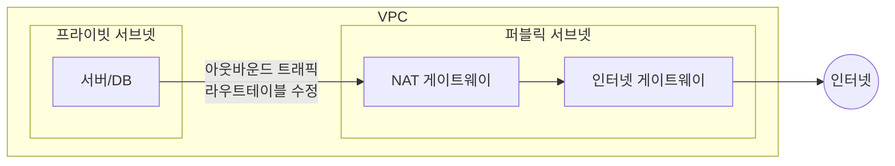
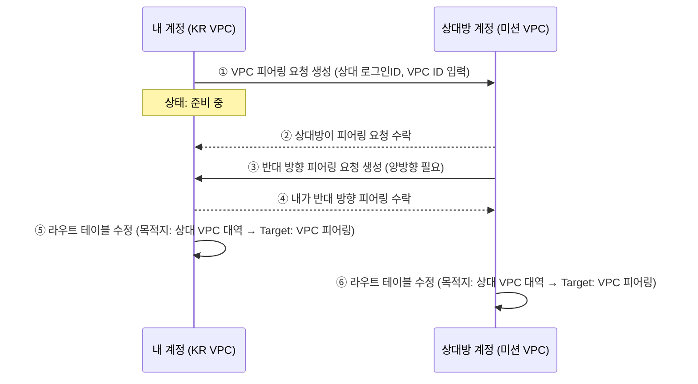
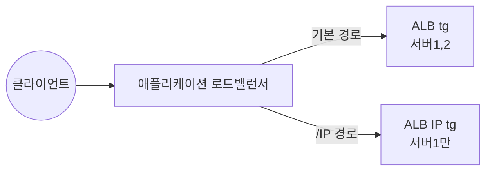

# 📘 NCP 강의 정리 — 5강. 네트워크(Network) 상품

> 네이버 클라우드 플랫폼(NCP) Professional 과정 **네트워크** 과목을 정리한 노트입니다.

---

## 📑 목차

1. [VPC (Virtual Private Cloud)](#1-vpc-virtual-private-cloud)
2. [서브넷 (Subnet)](#2-서브넷-subnet)
3. [Network ACL vs ACG 비교](#3-network-acl-vs-acg-비교)
4. [NAT 게이트웨이](#4-nat-게이트웨이)
5. [로드 밸런서(Load Balancer) 개요](#5-로드-밸런서load-balancer-개요)
6. [타겟 그룹과 헬스체크](#6-타겟-그룹과-헬스체크)
7. [글로벌 DNS (Global DNS)](#7-글로벌-dns-global-dns)
8. [IPsec VPN](#8-ipsec-vpn)
9. [🧪 실습 1: VPC 피어링 (다른 계정 간)](#9-실습-1-vpc-피어링-다른-계정-간)
10. [🧪 실습 2: 로드밸런서 생성 (NLB + ALB)](#10-실습-2-로드밸런서-생성-nlb--alb)
11. [🔑 핵심 암기 포인트 (시험 대비)](#11-핵심-암기-포인트-시험-대비)

---

## 1. VPC (Virtual Private Cloud)

| 항목 | 내용 |
|---|---|
| 정의 | 클라우드 상에서 **나만의 논리적인 네트워크 공간**을 설정하는 서비스 |
| 계정당 생성 개수 | 최대 **3개** |
| 생성 시 설정 항목 | VPC 이름, **IP 대역** |
| 사용 가능 IP 대역 | **10.0.0.0/8**, **172.16.0.0/12**, **192.168.0.0/16** 중 선택 |
| 넷마스크 범위 | 최소 **/28** ~ 최대 **/16** |

> 💡 여기서 제공되는 3가지 대역(10.x / 172.16.x / 192.168.x)은 **RFC 1918에서 정의한 사설(Private) IP 대역**입니다. 클라우드뿐 아니라 사내망 등에서도 널리 쓰이는 표준 사설 대역이라는 점을 알아두면 다른 클라우드(AWS 등)를 학습할 때도 도움이 됩니다.

### VPC 피어링 (VPC Peering)

- 서로 다른 **VPC 간 사설 통신**을 가능하게 하는 기능
- **같은 계정**의 다른 VPC뿐 아니라, **다른 NCP 계정**이 소유한 VPC와도 피어링 가능
- 다른 계정과 피어링할 때 필요한 정보: 상대방 **로그인 아이디**, **VPC ID**, **VPC 명**
- **단방향 설정**이므로, **양쪽 계정 모두에서 각각** 피어링을 생성/수락해야 양방향 통신 가능
- 피어링 연결 후에는 반드시 **라우트 테이블**을 수정하여, 상대방 VPC 대역으로 가는 트래픽이 **VPC 피어링**을 향하도록 설정해야 함

---

## 2. 서브넷 (Subnet)

| 항목 | 내용 |
|---|---|
| 정의 | VPC 대역 안에서 **용도별로 나누는 세그먼트** |
| 대역 지정 | VPC 대역 **범위 내에서** 지정 |
| 배치 존(Zone) | **KR-1 / KR-2** 중 선택 |
| 구분 | **퍼블릭 서브넷** (외부 인터넷 통신 가능) / **프라이빗 서브넷** (외부 인터넷 통신 불가) |
| VPC당 생성 개수 | 최대 **200개** |

> ⚠️ **퍼블릭 IP는 퍼블릭 서브넷에 배치된 서버에만 할당 가능**합니다. 프라이빗 서브넷의 서버는 퍼블릭 IP를 받을 수 없습니다.

---

## 3. Network ACL vs ACG 비교

둘 다 **방화벽 역할**을 하지만, 아래와 같은 차이가 있습니다.

| 구분 | **ACG** | **Network ACL** |
|---|---|---|
| 적용 대상 | 서버의 **네트워크 인터페이스** | **서브넷** |
| 지원 규칙 | **Allow(허용)만 지원** — 화이트리스트 방식 | **Allow + Deny 모두 지원** |
| 우선순위 | **없음** (모든 규칙을 판단해서 처리) | **있음** (우선순위에 따라 규칙 적용) |

> 💡 [3강 트러블슈팅 노트]에서 다뤘던 "같은 서브넷 내부 통신은 Network ACL을 거치지 않고 ACG만 적용된다"는 내용과 함께 기억해두면, 두 리소스의 역할 차이(적용 범위·정책 방식·우선순위)를 종합적으로 이해할 수 있습니다.

---

## 4. NAT 게이트웨이

- **프라이빗 서브넷**의 리소스는 기본적으로 외부 인터넷과 통신이 **불가능**
- 외부 패키지 다운로드 등 **아웃바운드 통신이 필요**한 경우, NAT 게이트웨이를 연동하여 통신 가능하도록 구현
- NAT 게이트웨이 생성만으로는 부족하며, **라우트 테이블**을 수정하여 프라이빗 서브넷의 외부 통신 트래픽이 **NAT 게이트웨이를 향하도록** 설정해야 함
- **존(Zone)당 1개**씩 생성 가능

---

## 5. 로드 밸런서(Load Balancer) 개요

### 5.1 처리 성능 구분

로드 밸런서는 **초당 연결 수(CPS, Connections Per Second)** 를 기준으로 **Small / Medium / Large** 로 구분됩니다. (예: 애플리케이션 로드밸런서 기준 Small 3만, Medium 6만 등 — 종류별 CPS 기준은 공식 문서에서 확인)

### 5.2 로드밸런서 3종 비교

| 구분 | **애플리케이션 로드밸런서(ALB)** | **네트워크 로드밸런서(NLB)** | **네트워크 프록시 로드밸런서(NLB Proxy)** |
|---|---|---|---|
| 지원 프로토콜/레이어 | **HTTP/HTTPS (L7)** | TCP/UDP (L4) | TCP (세션 유지 필요한 애플리케이션) |
| 핵심 특징 | **고정 IP** 할당, **URL/Host Header 기반 분기 처리** | **DSR(Direct Server Return)** 방식 → 고성능 분산 처리 | 과거 **Classic 플랫폼 로드밸런서**와 유사한 형태, **TCP 세션 관리** 가능 |
| 지원 분배 알고리즘 | Round Robin, Least Connection, Source IP Hash **(3종 모두)** | Round Robin, Source IP Hash **(2종)** | 3종 모두 지원 |
| SSL 오프로딩 | 가능 (**Certificate Manager**에 인증서 등록 필요) | 미지원 | 가능 (Certificate Manager 등록 필요) |
| 클라이언트 IP 로깅 | 기본적으로 로드밸런서 IP가 찍힘 → **별도 설정(X-Forwarded-For) 필요** | **기본적으로 클라이언트 IP가 그대로 찍힘** | - |

> 💡 **DSR(Direct Server Return) 방식이란?** 일반적인 로드밸런서는 클라이언트 요청도, 서버의 응답도 모두 로드밸런서를 거쳐 왕복합니다. 반면 DSR 방식은 **요청은 로드밸런서를 거치지만, 응답은 서버가 클라이언트에게 직접 전달**합니다. 로드밸런서가 응답 트래픽까지 처리할 필요가 없어 **훨씬 고성능의 분산 처리**가 가능합니다.

### 5.3 상황별 로드밸런서 선택 가이드

| 요구 사항 | 선택 |
|---|---|
| TCP 레벨의 **고성능 분산 처리**가 필요 | **NLB** (DSR 방식) |
| **TCP 세션 관리**가 필요 | **NLB Proxy** |
| **SSL 인증서 오프로딩**이 필요 | **ALB** 또는 **NLB Proxy** (Certificate Manager 연동) |
| **3가지 부하분산 알고리즘 모두** 사용하고 싶음 | **ALB** 또는 **NLB Proxy** |
| **L7 기능**(Host Header/URL 기반 분기)이 필요 | **ALB** |

### 5.4 부하 분산 알고리즘

| 알고리즘 | 동작 방식 |
|---|---|
| **라운드 로빈 (Round Robin)** | 요청이 올 때마다 바인딩된 서버에 **순차적으로** 하나씩 분배 |
| **최소 연결 (Least Connection)** | 현재 **연결 수가 가장 적은 서버**에 우선 분배 |
| **소스 IP 해시 (Source IP Hash)** | 클라이언트 **IP 해시값**을 기준으로 매핑되는 서버에 지속적으로 분배 → **동일 클라이언트가 같은 서버에 계속 붙어야 하는 경우**(세션 유지)에 적합 |

---

## 6. 타겟 그룹과 헬스체크

| 항목 | 내용 |
|---|---|
| 타겟 그룹 | 로드밸런서로 유입된 트래픽을 **처리할 서버 집합**을 지정 (반드시 **동일 VPC 내** 서버) |
| 헬스체크 주기 | **5초 ~ 300초** 사이에서 설정 가능 |
| 기본 부하분산 알고리즘 | 로드밸런서 생성 시 기본값은 **라운드 로빈** (생성 후 다른 알고리즘으로 변경 가능) |
| 생성 후 추가 설정 | **Sticky Session**, **Proxy Protocol** 등은 로드밸런서 생성 **완료 후에** 설정 가능 |
| 기본 모니터링 | 로드밸런서 생성 시 기본 제공 — **Concurrent Connection(동시 연결 수)**, **CPS(초당 연결 수)**, **Available Host(가용 호스트 수)** 등 |
| 포트 설정 | 여러 개의 로드밸런서 규칙(리스너)을 동시에 설정 가능, 서버 포트를 다른 규칙과 동일하게 지정하는 것도 가능 |

---

## 7. 글로벌 DNS (Global DNS)

| 항목 | 내용 |
|---|---|
| 정의 | 보유한 **도메인의 다양한 레코드**(A, CNAME 등)를 관리하는 서비스 |
| 부가 기능 | **Alias(별칭) 레코드** 기능(루트 도메인에도 CNAME과 유사하게 매핑 가능), **Excel 파일을 통한 대량 레코드 업로드** |
| 다중 서버 등록 시 | 하나의 레코드에 여러 서버 IP를 등록하면 **라운드 로빈처럼 순차적으로 트래픽 분산** |
| 모니터링 | 도메인별 **요청 수(질의 통계)** 모니터링 기능 제공, 조회 간격/기간을 짧은 단위부터 긴 단위까지 설정 가능 |
| 레코드 반영 | 레코드를 추가/수정한 후에는 반드시 **설정 적용(배포)** 을 진행해야 실제로 반영됨 |

---

## 8. IPsec VPN

| 항목 | 내용 |
|---|---|
| 정의 | NCP 네트워크와 **고객의 사내망(외부망)** 을 터널링으로 연결하여 **사설 통신**이 가능하도록 하는 서비스 |
| **IPsec** | 네트워크에서 안전한 연결을 위한 **통신 규칙(프로토콜) 세트** |
| **VPN(장비)** | IPsec을 이용해 **가상의 전용선 연결**을 제공하는 장비 |
| **게이트웨이** | 서로 다른 네트워크 간 통신을 위한 **접속 지점** |
| **터널** | 서로 다른 네트워크가 통신하기 위한 **특별한 통로** |
| 생성 방식 | 콘솔에서 **직접 생성** 가능 / **임대형(매니지드) IPsec VPN** 형태로도 제공 (임대 가능한 장비 목록은 공식 문서/포털 참고) |

---

## 9. 🧪 실습 1: VPC 피어링 (다른 계정 간)

1. **VPC 피어링 생성**: 요청 VPC(내 VPC) 선택 → "다른 계정" 선택 → 리전 선택 → 상대방 **로그인 아이디**, **VPC ID**, **VPC 명** 입력 → 생성 → 상태값 **"준비 중"** (상대방 수락 대기)
2. 상대방 계정에서 **VPC 피어링 메뉴 → 요청 수락**
3. **반대 방향**으로도 동일하게 피어링 생성 (요청 VPC와 대상 VPC를 바꿔서) → 다시 상대방이 수락 → 이렇게 **양방향 피어링**이 완성됨
4. **양쪽 VPC 모두** 라우트 테이블(퍼블릭 테이블 등)에 규칙 추가: **목적지 = 상대방 VPC 대역**, **타겟 = 생성한 VPC 피어링**

> 💡 VPC 피어링은 "연결을 맺는 것"과 "실제로 트래픽이 흐르게 하는 것"이 별개의 단계입니다. 피어링 수락까지 끝나도 **라우트 테이블을 수정하지 않으면 트래픽이 흐르지 않는다**는 점을 꼭 기억하세요.

---

## 10. 🧪 실습 2: 로드밸런서 생성 (NLB + ALB)

### 10.1 사전 준비

- **로드밸런서 전용 서브넷** 생성 (인터넷 게이트웨이 사용 여부는 Public/Private 무관하게 로드밸런서 생성 가능 — 실습에서는 Public으로 생성)
- **타겟 그룹 3개** 생성
  1. `NLB tg` — 타겟 유형: 서버, 프로토콜 **TCP 80**, 헬스체크 TCP 80 (30초 주기, 2회 연속 성공/실패로 판정), 대상: 서버 1·2
  2. `ALB tg` — 타겟 유형: 서버, 프로토콜 **HTTP 80**, 헬스체크 HTTP 80 HEAD 메소드, 대상: 서버 1·2
  3. `ALB IP tg` — URL 경로(`/IP`) 분기 처리를 위한 별도 타겟 그룹, 대상: 서버 1만

### 10.2 네트워크 로드밸런서(NLB) 생성

- 네트워크 타입: **퍼블릭 IP**, 처리 성능: **Small**, VPC/서브넷 선택, 공인 IP 신청
- 리스너: **TCP 80**, 타겟 그룹: `NLB tg` 선택 → 생성
- 접속 확인 → 서버에 접속해 액세스 로그(`/var/log/httpd`) 확인 시 **클라이언트의 실제 IP가 그대로 기록됨** (NLB는 DSR 방식이라 별도 설정 없이도 클라이언트 IP 확인 가능)

### 10.3 애플리케이션 로드밸런서(ALB) 생성

- 네트워크 타입: **퍼블릭 IP**, 처리 성능: **Small**, VPC/서브넷 선택, 공인 IP 신청
- 리스너: **HTTP 80**, 타겟 그룹: `ALB tg` 선택 → 생성

### 10.4 URL 기반 분기(Path-based Routing) 설정

- ALB **리스너 설정 변경 → 규칙 조회/변경 → 규칙 추가**
- 우선순위 지정, 조건: **Path(경로)** 기반, 경로값 `/IP` 지정 → 해당 경로로 들어오면 `ALB IP tg` (서버 1만 포함)로 라우팅되도록 설정
- 테스트: `/IP` 경로로 접속 시 **서버 1로만** 접근되는 것을 확인

### 10.5 클라이언트 IP 로깅 설정 (X-Forwarded-For)

ALB는 기본적으로 액세스 로그에 **로드밸런서의 IP**가 찍히기 때문에, 실제 **클라이언트 IP**를 확인하려면 서버 단에서 추가 설정이 필요합니다.

1. 서버 접속 → `/etc/httpd/conf/httpd.conf` 파일 수정
2. **LogFormat** 설정에서 클라이언트 IP를 나타내는 항목(`%h`)을 **`%{X-Forwarded-For}i`** 로 변경하여 **X-Forwarded-For 헤더 값**이 로그에 기록되도록 설정
3. 설정 저장 후 **Apache 서비스 재시작**

> 💡 **NLB는 클라이언트 IP가 기본으로 보이는데, ALB는 왜 안 보일까?** NLB는 DSR 방식이라 클라이언트의 패킷이 서버까지 그대로 전달되지만, **ALB(L7 로드밸런서)는 로드밸런서가 요청을 한 번 "받아서 다시 서버로 전달"하는 프록시 방식**이기 때문에 서버 입장에서는 발신자가 로드밸런서로 보이게 됩니다. 이때 로드밸런서가 원래 클라이언트의 IP를 **X-Forwarded-For**라는 HTTP 헤더에 담아 함께 전달해주므로, 웹서버가 이 헤더 값을 로그에 남기도록 설정을 바꿔줘야 실제 클라이언트 IP를 확인할 수 있습니다.

---

## 11. 🔑 핵심 암기 포인트 (시험 대비)

- [ ] VPC: 계정당 최대 **3개**, 사용 가능 대역 **10.0.0.0/8, 172.16.0.0/12, 192.168.0.0/16**, 넷마스크 **/28~/16**
- [ ] 서브넷: VPC당 최대 **200개**, **퍼블릭 IP는 퍼블릭 서브넷에만** 할당 가능
- [ ] **ACG(서버 단위, Allow만, 우선순위 없음)** vs **Network ACL(서브넷 단위, Allow+Deny, 우선순위 있음)**
- [ ] **NAT 게이트웨이**: 프라이빗 서브넷의 아웃바운드 인터넷용, **라우트 테이블 수정 필수**, 존당 1개
- [ ] **VPC 피어링**: 단방향이므로 **양쪽 모두 요청·수락 + 양쪽 라우트 테이블 수정** 필요
- [ ] 로드밸런서 3종: **ALB(HTTP/S, L7, URL분기)** / **NLB(DSR, 고성능)** / **NLB Proxy(TCP 세션 관리, Classic 유사)**
- [ ] 부하분산 알고리즘: **Round Robin / Least Connection / Source IP Hash** — ALB·NLB Proxy는 3종 모두, **NLB는 RR+Source IP Hash만**
- [ ] SSL 오프로딩 가능: **ALB, NLB Proxy** (Certificate Manager 사전 등록 필요) / **NLB는 불가**
- [ ] 헬스체크 주기: **5초~300초**, 기본 알고리즘은 **라운드 로빈**
- [ ] **NLB는 클라이언트 IP가 그대로 로그에 찍히지만, ALB는 X-Forwarded-For 설정을 해야 클라이언트 IP 확인 가능**
- [ ] 글로벌 DNS: 여러 IP 등록 시 **라운드 로빈처럼 순차 분산**, 레코드 변경 후 **설정 적용(배포) 필수**
- [ ] IPsec VPN 4대 용어: **IPsec(프로토콜 세트) / VPN 장비 / 게이트웨이(접속 지점) / 터널(통로)**

---
