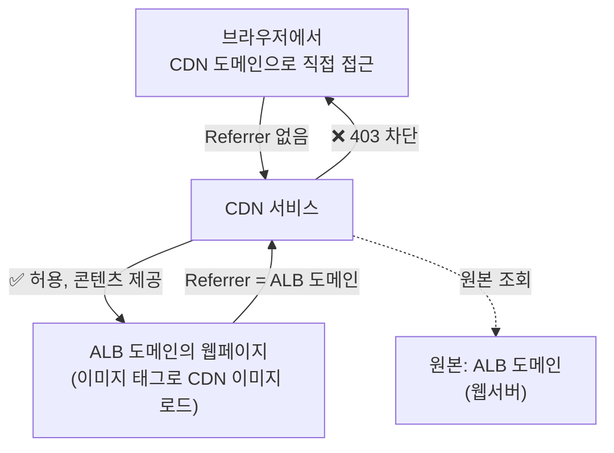

# 📘 NCP 강의 정리 — 6강. 콘텐츠 딜리버리(Content Delivery) 상품

> 네이버 클라우드 플랫폼(NCP) Professional 과정 **콘텐츠 딜리버리(CDN)** 과목을 정리한 노트입니다.

---

## 📑 목차

1. [CDN 개요](#1-cdn-개요)
2. [CDN 서비스 종류: CDN+ (국내) vs Global CDN (해외)](#2-cdn-서비스-종류-cdn-국내-vs-global-cdn-해외)
3. [CDN 주요 설정 요소](#3-cdn-주요-설정-요소)
4. [🧪 실습: CDN+ 생성 및 웹서버 연동 (Referrer 제한 포함)](#4-실습-cdn-생성-및-웹서버-연동-referrer-제한-포함)
5. [🔑 핵심 암기 포인트 (시험 대비)](#5-핵심-암기-포인트-시험-대비)

---

## 1. CDN 개요

| 항목 | 내용 |
|---|---|
| 사용 목적 | 이미지, 파일, 동영상 등을 사용자에게 **안정적으로 전송**하기 위해 사용 |
| 핵심 효과 | 대규모 트래픽으로 인한 **원본 서버의 부하를 줄이고**, 안정적인 서비스 제공 |
| 요금 구조 | **월 전송량 요금 + 월 요청 수 요금**을 합산하여 과금 |

> 💡 **CDN(Content Delivery Network)의 기본 원리**: 원본 서버 콘텐츠를 전 세계(또는 국내) 여러 지점의 **캐시(엣지) 서버에 복사**해두고, 사용자가 자신과 **가장 가까운 캐시 서버**에서 콘텐츠를 받아가도록 하는 방식입니다. 그 결과 ① 원본 서버 부하 감소, ② 사용자 체감 응답 속도 향상이라는 두 가지 효과를 동시에 얻을 수 있습니다.

---

## 2. CDN 서비스 종류: CDN+ (국내) vs Global CDN (해외)

| 구분 | **CDN+ (씨디엔 플러스)** | **Global CDN (글로벌 CDN)** |
|---|---|---|
| 대상 | **국내 사용자** 대상 | **해외 사용자** 대상 — 사용자와 가장 가까운 해외 PoP(엣지) 서버에서 콘텐츠 제공 |
| 제공 방식 | NCP 자체 서비스 | **아카마이(Akamai)** 를 통해 제공 |
| 원본(Origin) | **오브젝트 스토리지** 또는 **서버** (NCP 내부/외부 서버 모두 가능) | 오브젝트 스토리지 또는 서버 (콘솔에서 캐싱 등 옵션을 손쉽게 구성) |

> 💡 **CDN+ = 국내형, Global CDN = 해외형**으로 심플하게 기억하면 됩니다. 시험에서 "해외 사용자에게 콘텐츠를 안정적으로 제공하려면?"이라는 질문에는 **Global CDN**이 정답입니다.

---

## 3. CDN 주요 설정 요소

| 설정 항목 | 내용 |
|---|---|
| **지원 프로토콜** | **HTTP, HTTPS** |
| **원본(Origin)** | 네이버 클라우드 플랫폼의 **오브젝트 스토리지** 또는 **서버**(NCP에서 운영하지 않는 **외부 서버도 원본으로 지정 가능**) |
| **도메인** | **CDN 전용 도메인**을 할당받거나, 보유하고 있는 **커스텀 도메인** 사용 가능 |
| **액세스 로그** | CDN으로 들어온 요청을 로그로 저장하는 기능 (옵션) |
| **캐시 만료(Cache Expiry)** | 기본값 **7일** — 이 주기마다 원본 콘텐츠의 변경 여부를 체크해서 캐시를 갱신 |
| **레퍼러(Referrer) 도메인 설정** | **특정 도메인에서 온 요청일 때만** 콘텐츠를 제공하도록 제한하는 기능. **레퍼러가 없는 요청은 차단**하도록 설정 가능 (핫링크 방지) |

---

## 4. 🧪 실습: CDN+ 생성 및 웹서버 연동 (Referrer 제한 포함)

### 4.1 CDN 생성 절차

1. **콘텐츠 딜리버리 > CDN 플러스** 메뉴에서 신청
2. CDN 이름 지정, **서비스 프로토콜: HTTP**, 서비스 도메인은 **CDN 기본 도메인** 사용, 액세스 로그는 기본값 유지
3. **원본 지정**: "직접 입력" 선택 → 기존에 만들어 둔 **애플리케이션 로드밸런서(ALB)의 도메인**을 원본으로 지정
4. **캐싱 설정**: Cache Expiry **기본값 7일** 유지
5. **레퍼러(Referrer) 도메인 설정**: 레퍼러 도메인으로 **ALB 도메인**을 등록 → **"레퍼러가 없는 경우 허용하지 않음"** 옵션 적용
6. 최종 확인 후 **CDN 신청** → 운영 중 상태로 전환될 때까지 대기

### 4.2 웹서버 콘텐츠를 CDN 경유로 전환

1. 웹서버(`/var/www/html`)의 이미지 참조 경로(예: `logo1.jpg`)를 **CDN 서비스 도메인**을 바라보도록 수정 (`http://{CDN 도메인}/logo1.jpg`)
2. 저장 후 반영

### 4.3 Referrer 제한 동작 테스트

| 접근 방법 | 결과 | 이유 |
|---|---|---|
| **CDN 도메인으로 이미지에 직접 접근** (브라우저 주소창에 이미지 URL 직접 입력) | ❌ **403 에러** | 브라우저 주소창에 직접 입력하면 **Referrer 헤더가 비어있음** → "레퍼러 없는 요청 차단" 정책에 의해 거부 |
| **ALB 도메인(웹페이지)에 접속해서 이미지 확인** | ✅ **정상 노출** | 웹페이지 안의 `` 태그로 이미지가 로드될 때는 **Referrer 헤더에 ALB 도메인이 자동으로 담겨** 요청되므로, 등록된 레퍼러와 일치해 허용됨 |

> 💡 **레퍼러(Referrer) 검사는 대표적인 "핫링크(Hotlink) 방지" 기법**입니다. 다른 사이트가 내 CDN의 이미지 URL을 직접 가져다 자신의 페이지에 임베드해서 내 트래픽·비용을 소모시키는 것을 막기 위해, "내 웹사이트를 거쳐서 온 요청만 허용"하도록 설정하는 것입니다.

---

## 5. 🔑 핵심 암기 포인트 (시험 대비)

- [ ] CDN 사용 목적: **원본 서버 부하 감소 + 안정적인 콘텐츠 전송**
- [ ] CDN 요금 = **월 전송량 요금 + 월 요청 수 요금**
- [ ] **CDN+ = 국내형** / **Global CDN = 해외형(아카마이 제공)**
- [ ] CDN 원본(Origin)으로 지정 가능한 대상: **오브젝트 스토리지, NCP 서버, 심지어 외부(타사) 서버까지도 가능**
- [ ] 지원 프로토콜: **HTTP, HTTPS**
- [ ] Cache Expiry 기본값: **7일**
- [ ] **레퍼러(Referrer) 도메인 설정**으로 핫링크 방지 가능 — **레퍼러 없는 요청은 차단** 옵션 사용 시, 브라우저 주소창 직접 접근은 **403 에러**, 등록된 도메인 경유 접근은 정상 허용

---
