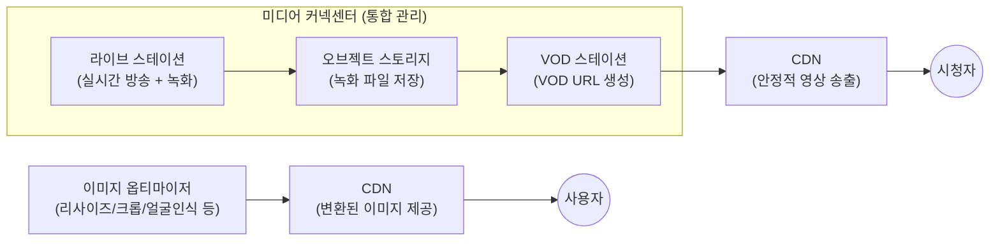

# 📘 NCP 강의 정리 — 7강. 미디어(Media) 상품

> 네이버 클라우드 플랫폼(NCP) Professional 과정 **미디어** 과목(Live Station, VOD Station, Image Optimizer, Media Connect Center)을 정리한 노트입니다.

---

## 📑 목차

1. [라이브 스테이션 (Live Station)](#1-라이브-스테이션-live-station)
2. [VOD 스테이션 (VOD Station)](#2-vod-스테이션-vod-station)
3. [이미지 옵티마이저 (Image Optimizer)](#3-이미지-옵티마이저-image-optimizer)
4. [미디어 커넥센터 (Media Connect Center)](#4-미디어-커넥센터-media-connect-center)
5. [서비스 연동 구조 한눈에 보기](#5-서비스-연동-구조-한눈에-보기)
6. [🔑 핵심 암기 포인트 (시험 대비)](#6-핵심-암기-포인트-시험-대비)

---

## 1. 라이브 스테이션 (Live Station)

| 항목 | 내용 |
|---|---|
| 정의 | NCP를 통해 **실시간 방송(라이브 스트리밍)** 을 할 수 있는 서비스 |
| 실제 활용 사례 | **네이버 쇼핑의 라이브 쇼핑**에서 사용되는 실시간 방송 엔진과 **동일한 엔진** 기반 |
| **트랜스코딩(Transcoding)** | 하나의 원본 영상을 **여러 화질로 변환**하여 송출 |
| 모니터링 | 현재 **스트림 상태**를 실시간 확인 |
| 썸네일 추출 | 방송 화면의 **썸네일 이미지 자동 추출** |
| **타임 시프트(Time Shift)** | 시청자가 놓친 구간으로 **되감기**하여 볼 수 있는 기능 |
| CDN 연동 | **CDN과 연동**되어 안정적인 영상 송출 가능 |
| 녹화 | 방송 종료 후 **녹화 파일 저장** 가능 — **MP4** 또는 **HLS** 형태 지원 |

> 💡 **HLS(HTTP Live Streaming)**란 영상을 여러 개의 작은 조각(세그먼트)으로 나누어 HTTP로 전송하는 스트리밍 프로토콜입니다. 네트워크 상황에 따라 화질을 자동으로 조절(적응형 비트레이트)할 수 있어 라이브·VOD 스트리밍에 널리 사용됩니다.

---

## 2. VOD 스테이션 (VOD Station)

| 항목 | 내용 |
|---|---|
| 정의 | **VOD(주문형 비디오, Video On Demand)** 서비스를 구현할 수 있는 서비스 |
| Live Station 연동 | 라이브 방송 종료 후 생성된 **녹화 파일을 VOD 서비스로 그대로 전환** 가능 (방송을 놓친 시청자를 위한 다시보기 구현에 활용) |
| **DRM** | NCP가 자체 DRM 솔루션을 제공하지는 않으며, **외부 DRM 솔루션과 연동**하여 사용 |
| 영상 업로드/제공 방식 | 영상을 **오브젝트 스토리지**에 업로드 → VOD 스테이션이 해당 영상을 불러와 **VOD 전용 URL 생성** → 이 URL로 누구나 시청 가능 |
| CDN 연동 | 영상을 **CDN을 통해 안정적으로 송출** |

---

## 3. 이미지 옵티마이저 (Image Optimizer)

| 항목 | 내용 |
|---|---|
| 정의 | 보유한 이미지를 다양한 방법으로 **변환**할 수 있는 서비스 |
| 주요 변환 기능 | **리사이즈, 크롭, 자동 회전, 얼굴 인식** 등 |
| 변환 방식 | ① (기존) **쿼리 스트링**을 직접 작성하여 옵션 지정 / ② (신규) **"쉬운 입력"** 기능 — 변환 옵션을 선택하고 **수치만 입력**하면 쿼리 스트링이 자동 생성됨 |
| CDN 연동 | 변환된 이미지를 **CDN을 통해 제공** |
| 미리보기 | 변환 후 이미지가 어떻게 보일지 **미리보기(Preview)** 기능 제공 |

---

## 4. 미디어 커넥센터 (Media Connect Center)

| 항목 | 내용 |
|---|---|
| 정의 | **오브젝트 스토리지 + 라이브 스테이션 + VOD 스테이션**을 하나로 묶어 **통합 관리**할 수 있는 미디어 서비스 |
| 핵심 가치 | 라이브 방송 종료 → 오브젝트 스토리지 저장 → VOD 스테이션 URL 생성까지의 **일련의 과정을 각각 따로 설정할 필요 없이 통합적으로 관리** |
| CDN 연동 | **CDN을 바로 연동**하여 사용 가능 (별도 연동 설정 불필요) |
| 관리 | 전체 서비스를 한눈에 확인할 수 있는 **대시보드** 제공 |

---

## 5. 서비스 연동 구조 한눈에 보기

> 💡 4개 서비스를 한 줄로 정리하면: **Live Station(실시간 방송) → Object Storage(녹화 저장) → VOD Station(다시보기 URL 생성)** 흐름을 **Media Connect Center가 통째로 묶어서 관리**해주고, 이 모든 영상은 **CDN**을 통해 안정적으로 송출됩니다. **Image Optimizer**는 영상이 아닌 **이미지**를 대상으로 하는 별도 서비스이며, 마찬가지로 CDN과 연동됩니다.

---

## 6. 🔑 핵심 암기 포인트 (시험 대비)

- [ ] **라이브 스테이션**: 실시간 방송, **트랜스코딩(여러 화질 변환)**, **타임 시프트(되감기)**, 녹화 파일은 **MP4/HLS**로 저장
- [ ] **VOD 스테이션**: 영상은 **오브젝트 스토리지**에 업로드 → VOD 전용 URL 생성 / **DRM은 외부 솔루션 연동**으로만 지원(자체 제공 X)
- [ ] **이미지 옵티마이저**: 리사이즈·크롭·자동회전·얼굴인식 등 이미지 변환 / **"쉬운 입력"** 기능으로 쿼리스트링 자동 생성
- [ ] **미디어 커넥센터**: 오브젝트 스토리지 + 라이브 스테이션 + VOD 스테이션을 **하나로 통합 관리**, **CDN 연동 기본 제공**, 통합 대시보드
- [ ] 4가지 서비스 **모두 CDN과 연동**되어 안정적인 콘텐츠 송출을 지원한다는 공통점 기억하기

---
