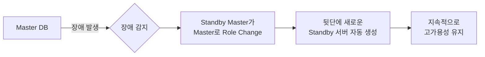
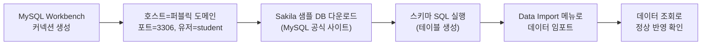
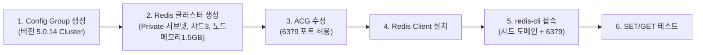

# 📘 NCP 강의 정리 — 8강. 데이터베이스(Database) 상품

> 네이버 클라우드 플랫폼(NCP) Professional 과정 **데이터베이스** 과목(Cloud DB for MySQL/Redis/MongoDB/PostgreSQL)을 정리한 노트입니다.

---

## 📑 목차

1. [Cloud DB 공통 특징](#1-cloud-db-공통-특징)
2. [Cloud DB for MySQL — 개요](#2-cloud-db-for-mysql--개요)
3. [Cloud DB for MySQL — 오퍼레이션](#3-cloud-db-for-mysql--오퍼레이션)
4. [Cloud DB for Redis — 개요](#4-cloud-db-for-redis--개요)
5. [Cloud DB for Redis — 오퍼레이션](#5-cloud-db-for-redis--오퍼레이션)
6. [Cloud DB for MongoDB — 개요](#6-cloud-db-for-mongodb--개요)
7. [Cloud DB for PostgreSQL — 개요](#7-cloud-db-for-postgresql--개요)
8. [DB별 스펙/특징 한눈에 비교](#8-db별-스펙특징-한눈에-비교)
9. [🧪 실습 1: MySQL 퍼블릭 도메인 · 데이터 임포트 · 이벤트 알람 · 페일오버](#9-실습-1-mysql-퍼블릭-도메인--데이터-임포트--이벤트-알람--페일오버)
10. [🧪 실습 2: Redis 클러스터 생성 및 CLI 접속](#10-실습-2-redis-클러스터-생성-및-cli-접속)
11. [🔑 핵심 암기 포인트 (시험 대비)](#11-핵심-암기-포인트-시험-대비)

---

## 1. Cloud DB 공통 특징

"**클라우드 DB 4 (Cloud DB for ~)**" 시리즈는 NCP의 **완전 관리형 데이터베이스** 서비스입니다.

- 클릭 몇 번만으로 **자동 페일오버**, **자동 백업** 같은 핵심 기능이 자동으로 설정된 DB 서버가 생성됨
- 아래에서 살펴볼 MySQL, Redis, MongoDB, PostgreSQL 모두 이 관리형 서비스의 원칙을 공통으로 따름

---

## 2. Cloud DB for MySQL — 개요

| 항목 | 내용 |
|---|---|
| 최대 스펙 | **최대 32 vCPU / 256GB 메모리** |
| 스토리지 | 최대 **6TB까지 자동 확장** |
| Slave(읽기 복제) DB | 읽기 부하 분산용으로 추가 가능 (개요 강의에서는 **최대 10대**로 안내 — 아래 "⚠️" 참고) |
| 읽기 부하 분산 | Slave DB 앞단에 **프라이빗 IP 로드밸런서**를 구성해서 분산 |
| 자동 백업 | 주기 설정 가능, 백업 파일 **최대 30일 보관** |
| 복원 | 백업 파일 기반 복원 + **시점 복원(Point-in-Time Recovery)** 지원 |
| 모니터링/알람 | 특정 임계치 도달 시 알람 |
| **Multi-Zone** | 고가용성(HA) 타입으로 생성 시 **마스터와 스탠바이 마스터가 서로 다른 존**에 배치 가능 |
| 네트워크 배치 | **퍼블릭 서브넷**에 배치 시 외부 접근용 **퍼블릭 도메인 할당 가능** / **프라이빗 서브넷**에 배치 시 퍼블릭 도메인 **할당 불가** |

> ⚠️ 강의 중 슬레이브(Slave) DB의 최대 추가 대수가 **개요 파트에서는 "최대 10대"**, **오퍼레이션 파트에서는 "5대까지 가능"**으로 서로 다르게 언급되었습니다. 실제 최대 대수는 시점이나 조건에 따라 달라질 수 있으니, 시험/실무에 반영하기 전에 **NCP 공식 문서에서 최신 수치를 반드시 재확인**하시길 권장합니다.

### 고가용성(HA) 동작 방식

- HA 타입: **Master + Standby Master** 2대 구성 → Master 장애 시 Standby가 **Role Change**하여 새 Master가 되고, 뒤이어 새 Standby가 자동 생성되어 고가용성이 계속 유지됨
- 콘솔의 **"마스터 DB 페일오버"** 버튼으로 실제 페일오버 동작을 **직접 테스트** 가능
- **DB 프로세스 모니터링**: DB 서버에 직접 접속하지 않아도 콘솔에서 실행 중인 쿼리 확인 가능
- **과금**: HA 타입은 Master+Standby **2대분 과금** / 고가용성이 필요 없다면 **스탠드얼론(Standalone)** 타입으로 생성 시 **1대만 과금**되면서도 자동 백업·모니터링 등 관리형 서비스의 이점은 그대로 사용 가능

---

## 3. Cloud DB for MySQL — 오퍼레이션

| 기능 | 설명 |
|---|---|
| **DB 프로세스 리스트** | `SHOW PROCESSLIST` 명령 없이 콘솔에서 세션 ID, 유저명, 세션 호스트 IP 등 확인 → 특정 세션을 **강제 종료(Kill Session)** 가능 |
| **리플리케이션 상태 확인** | `SHOW SLAVE STATUS`와 동일한 정보를 콘솔에서 확인 → 오류 발생 시 **"해당 에러만 건너뛰기(Skip Replication Error)"** 또는 **"슬레이브 DB 재설치"** 중 선택 가능 |
| **로그 확인** | **바이너리 로그, 슬로우 로그, 에러 로그, 제너럴 로그** 확인 가능 → **오브젝트 스토리지로 내보내기** 지원 |
| **자동 백업** | **매일 1회** 수행, 최대 **30일** 보관, 백업 시각·보관 기간 등 정보 확인 가능 |
| **복원** | 백업 파일로 복원 시 서버는 **리커버리 모드**(조회 전용)로 생성됨, **시점 복원(PITR)** 지원 |
| **이벤트(알람) 설정** | **OS 영역**과 **데이터베이스 영역** 각각에 대해 임계치 알람 설정 가능 |
| **엔진 업그레이드** | 마이너 버전 **롤링 업그레이드** 지원 — 업그레이드 중 서비스 차단을 최소화하기 위해 **Master → Standby로 전환** 후 **한 대씩 순차** 진행 |
| **컨피그(Config) 관리** | 대표 옵션: **innodb_buffer_pool_size**(권장값: 메모리의 **50~80%**, 변경 후 **재시작 필요**), **max_connections**, **general_log** 등 |
| **컨피그 그룹(Config Group)** | 옵션들을 그룹 단위로 생성/변경/삭제 가능. **운영 중인 DB에 적용된 컨피그 그룹은 삭제 불가** |
| **Slave 스펙 변경** | Slave의 스펙을 바꾸면 **Principal(주)/Mirror(미러) DB도 함께 동일 스펙**으로 변경됨 (서버별로 다른 스펙 유지 불가) |
| **쿼리 분석 (버블 차트)** | X축: **쿼리 일별 수행 횟수 합계** / Y축: **CPU 소모량** / **버블 크기**: 메모리 읽기 수 → 버블 클릭 시 해당 쿼리 확인 가능 |

---

## 4. Cloud DB for Redis — 개요

| 항목 | 내용 |
|---|---|
| 정의 | **인메모리 캐시(Redis)** 를 완전 관리형으로 제공, **자동 복구**로 안정적 운영 |
| 구성 형태 | **VPC 플랫폼에서 클러스터 형태**로 구성 가능, 반드시 **프라이빗 서브넷**에 생성 |
| 샤드(Shard) | 최소 **3개** ~ 최대 **10개** |
| 샤드당 슬레이브 노드 | 최대 **4개** |
| 서버 사양 | CPU **4코어로 고정** (최적 성능을 위해 고정 제공) |
| 옵션 관리 | **컨피그 그룹(Config Group)** 단위로 제공(관리형 특성상 세부 옵션은 제한적) |
| 모니터링/알람 | **OS 모니터링** 제공, 임계치 도달 시 메일/SMS 알람 |
| 자동 백업 | 백업 파일 최대 **70일** 보관 |

---

## 5. Cloud DB for Redis — 오퍼레이션

| 기능 | 설명 |
|---|---|
| **컨피그 관리** | 변경 가능한 옵션 목록에서 원하는 값을 지정해 설정 |
| **모니터링** | **Redis 대시보드 + OS 대시보드** 제공, 최근 **4주 이내** 지표 확인 가능 |
| **자동 백업/복원** | 백업 파일은 별도 데이터 스토리지에 저장되며, **백업 완료 시점 기준**으로 복원 가능 |

---

## 6. Cloud DB for MongoDB — 개요

| 항목 | 내용 |
|---|---|
| 정의 | 대표적인 **NoSQL 데이터베이스**인 MongoDB를 손쉽게 구성할 수 있는 서비스 |
| 제공 플랫폼 | **VPC 플랫폼에서만** 제공 |
| 설치 방식 | **샤드(Shard) 방식** 또는 **레플리카 셋(Replica Set) 방식** 중 선택 |
| Replica Set 확장 | 최대 **7개**까지 확장 가능 |
| 부하 분산 | **읽기 부하 분산** 기능 제공 |
| 알람 | 이벤트 발생 시 **SMS/이메일** 통보 |

---

## 7. Cloud DB for PostgreSQL — 개요

| 항목 | 내용 |
|---|---|
| **페일오버** | PostgreSQL은 **기본적으로 페일오버 기능을 제공하지 않지만**, NCP의 Cloud DB for PostgreSQL은 이를 **추가로 제공**하여 고가용성 확보 |
| 자동 백업 | 최대 **30일** 보관 |
| 저장 공간 | **10GB ~ 6TB**까지 확장 |
| 구조 | **마스터-슬레이브** 구조, Slave 최대 **5대** |
| 부하 분산 | Slave DB 앞단에 **프라이빗 로드밸런서** 배치로 부하 분산 |

> 💡 PostgreSQL 자체(오픈소스)는 기본 내장 Failover 솔루션이 없어 별도 도구(Patroni, repmgr 등)로 구성해야 하는 경우가 많습니다. NCP Cloud DB for PostgreSQL은 이런 부분을 **관리형 서비스 차원에서 대신 구현**해 제공한다는 점이 포인트입니다.

---

## 8. DB별 스펙/특징 한눈에 비교

| 구분 | **MySQL** | **Redis** | **MongoDB** | **PostgreSQL** |
|---|---|---|---|---|
| 유형 | RDBMS | 인메모리 캐시 (NoSQL) | NoSQL (Document) | RDBMS |
| 배치 서브넷 | Public/Private 선택 가능 | **Private 전용** | VPC 플랫폼 전용 | - |
| 복제 구성 | Slave (개요: 10대 / 오퍼레이션: 5대 — 안내 상이, 공식문서 확인 권장) | 샤드 3~10개, 샤드당 Slave 최대 4개 | Replica Set 최대 7개 | Slave 최대 5대 |
| Multi-Zone | **지원** (Master/Standby 다른 존 배치) | - | - | - |
| 백업 보관 기간 | 최대 30일 | 최대 **70일** | - | 최대 30일 |
| 특이사항 | 시점복원(PITR), 쿼리 분석(버블차트) | CPU 4코어 고정, 일부 명령어 제한 | Shard/Replica Set 선택 | 자체엔 없는 Failover를 NCP가 추가 제공 |

---

## 9. 🧪 실습 1: MySQL 퍼블릭 도메인 · 데이터 임포트 · 이벤트 알람 · 페일오버

### 9.1 퍼블릭 도메인 할당 & ACG 조정

1. **DB 관리 > 퍼블릭 도메인 관리**에서 신청 → 잠시 후 외부 접근용 **퍼블릭 도메인**이 생성됨
2. **ACG 수정**: 서버 메뉴의 ACG에서 Cloud DB용 ACG(예: `클라우드 마이SQL`) 선택 → 기존 **"any 오픈"** 규칙 삭제 → **내 IP에서만 3306 포트 접근 허용**하도록 변경

### 9.2 MySQL Workbench로 접속 & 샘플 데이터 임포트

1. **MySQL Workbench**에서 새 커넥션 생성: 호스트 네임 = **퍼블릭 도메인**, 포트 = **3306**, 유저 네임 = `student`
2. MySQL 공식 사이트에서 제공하는 **Sakila 샘플 데이터베이스**(스키마 SQL + 데이터 SQL) 다운로드
3. **스키마 SQL** 실행 → `sakila` 데이터베이스에 테이블 구조 생성
4. **Administration > Data Import** 메뉴에서 데이터 SQL 파일 선택, 타겟 스키마를 `sakila`로 지정 → **Start Import**
5. 임포트 완료 후 데이터 조회로 정상 반영 확인

### 9.3 이벤트(알람) 설정 (Cloud Insight 연동)

1. Cloud DB의 **이벤트 설정** 메뉴 → **"이벤트 룰 생성"** (Cloud Insight로 연결)
2. **감시 상품**: Cloud DB for MySQL 선택 → **감시 그룹** 생성(내가 운영 중인 DB 자동 인식되어 선택)
3. **메트릭 템플릿** 생성: 예) **Slave Run**(크리티컬, 조건 50, 지속시간 1분), **Slow Query**(워닝, 조건 50, 지속시간 1분)
4. **통보 대상자 그룹** 생성: 이름, 이메일(필요 시 휴대폰 번호)을 등록한 대상자를 그룹으로 묶음
5. 알람 규칙 이름 지정 후 생성 → 이후 지정한 메트릭이 임계치를 초과하면 **이메일/SMS로 알람** 수신

### 9.4 마스터 DB 페일오버 테스트

- **DB 관리 > 마스터 DB 페일오버** 버튼 클릭 → Master ↔ Standby 간 **Role Change**가 실제로 수행되는 과정을 콘솔에서 확인 가능 (소요 시간, 정상 동작 여부 확인)

---

## 10. 🧪 실습 2: Redis 클러스터 생성 및 CLI 접속

1. **Config Group 생성**: 버전 **5.0.14 (Cluster)** 선택, 이름 지정 → 옵션은 기본값 유지 가능
2. **Redis 클러스터 생성**: 버전은 Config Group과 **동일하게 일치**시켜야 함, VPC의 **프라이빗 서브넷** 선택(Redis는 Private 전용), **노드당 메모리 1.5GB**, **샤드 수 3개**, 복제본 개수(선택), 위에서 만든 Config Group 지정, 서버·서비스 이름 지정, 포트 **6379**, 백업(최대 7일, 자동 시간) 설정 → 생성
3. **ACG 수정**: Redis용으로 자동 생성된 ACG에 **웹서버가 사용하는 ACG로부터 6379 포트 접근을 허용**하는 규칙 추가
4. 서버에서 **Redis Client(redis-cli 등) 설치**
5. `redis-cli -h {샤드 접속 도메인} -p 6379` 로 접속 (접속 정보는 **레디스 설정** 메뉴에서 샤드별 도메인 확인 가능)
6. 테스트: `SET NCP "NCP 서비스"` → `GET NCP` 로 값 조회 확인

> ⚠️ **명령어 제한**: 클라우드 DB for Redis는 **안정적인 운영을 위해 일부 명령어(예: 전체 키 조회 계열 명령)의 사용을 제한**합니다. 사용 금지 명령어 목록은 **NCP 공식 사용자 가이드**에서 확인해야 합니다.

---

## 11. 🔑 핵심 암기 포인트 (시험 대비)

- [ ] Cloud DB 시리즈는 **완전 관리형** — 자동 페일오버·자동 백업 기본 제공
- [ ] **MySQL**: 최대 32vCPU/256GB, 스토리지 최대 **6TB 자동확장**, 백업 최대 **30일**, **퍼블릭 서브넷 배치 시에만 퍼블릭 도메인 할당 가능**
- [ ] MySQL HA: Master 장애 시 **Standby가 Role Change** → 새 Standby 자동 생성으로 지속적 HA 유지 / **HA=2대 과금, Standalone=1대 과금**
- [ ] MySQL 대표 컨피그: **innodb_buffer_pool_size(메모리의 50~80%, 변경 후 재시작 필요)**
- [ ] MySQL 쿼리 분석 버블차트: **X=수행횟수, Y=CPU소모량, 버블크기=메모리 읽기수**
- [ ] **Redis**: **Private 서브넷 전용**, 샤드 **3~10개**, 샤드당 Slave 최대 **4개**, CPU **4코어 고정**, 백업 최대 **70일**, 일부 명령어 사용 제한
- [ ] **MongoDB**: VPC 전용, **Shard 또는 Replica Set** 방식 선택, Replica Set 최대 **7개**
- [ ] **PostgreSQL**: 원래 Failover 미지원 DB인데 **NCP가 Failover 기능을 추가 제공**, Slave 최대 **5대**, 저장공간 10GB~6TB
- [ ] Cloud DB 4종 모두 **임계치 기반 이메일/SMS 알람** 설정 가능 (Cloud Insight 연동)

---
