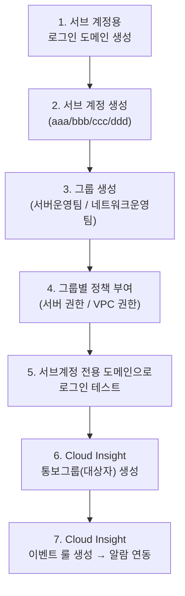
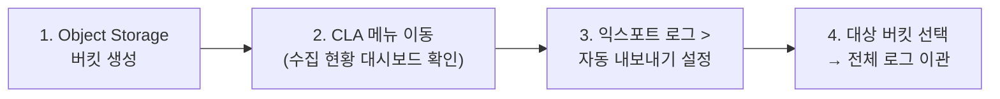

# 📘 NCP 강의 정리 — 9강. 매니지먼트 앤 거버넌스(Management and Governance) 상품

> 네이버 클라우드 플랫폼(NCP) Professional 과정 **매니지먼트 앤 거버넌스** 과목을 정리한 노트입니다.
> 이 과목은 서비스 종류가 많고 이름이 비슷해 헷갈리기 쉬우니, 각 서비스가 **"무엇을 대상으로, 무엇을 해주는지"** 중심으로 정리했습니다. 강의 원문 내용 + 이해를 돕기 위한 보충 설명(💡)을 함께 담았습니다.

---

## 📑 목차

1. [서브 어카운트 (Sub Account)](#1-서브-어카운트-sub-account)
2. [WMS (Web service Monitoring System)](#2-wms-web-service-monitoring-system)
3. [네트워크 트래픽 모니터링](#3-네트워크-트래픽-모니터링)
4. [클라우드 액티비티 트레이서 (Cloud Activity Tracer)](#4-클라우드-액티비티-트레이서-cloud-activity-tracer)
5. [엔클라우드 툴즈 (Ncloud Tools)](#5-엔클라우드-툴즈-ncloud-tools)
6. [리소스 매니저 (Resource Manager)](#6-리소스-매니저-resource-manager)
7. [클라우드 인사이트 (Cloud Insight)](#7-클라우드-인사이트-cloud-insight)
8. [클라우드 어드바이저 (Cloud Advisor)](#8-클라우드-어드바이저-cloud-advisor)
9. [오가니제이션 (Organization)](#9-오가니제이션-organization)
10. [클라우드 로그 애널리틱스 (CLA)](#10-클라우드-로그-애널리틱스-cla)
11. [엘사 (ELSA)](#11-엘사-elsa)
12. [🗺️ 헷갈리는 서비스 한눈에 비교](#12-헷갈리는-서비스-한눈에-비교)
13. [🧪 실습 1: 서브 어카운트 + 그룹/정책 + Cloud Insight 알람 연동](#13-실습-1-서브-어카운트--그룹정책--cloud-insight-알람-연동)
14. [🧪 실습 2: CLA 로그 오브젝트 스토리지 자동 내보내기](#14-실습-2-cla-로그-오브젝트-스토리지-자동-내보내기)
15. [🔑 핵심 암기 포인트 (시험 대비)](#15-핵심-암기-포인트-시험-대비)

---

## 1. 서브 어카운트 (Sub Account)

| 항목 | 내용 |
|---|---|
| 정의 | **역할 기반**으로 권한을 분리할 수 있는 서비스 |
| 마스터 어카운트 | 모든 서비스에 접근 가능한 최상위 계정 — 서브 어카운트를 생성하고 권한을 부여하는 주체 |
| 주요 사용 사례 | ① 동일 인프라를 **여러 담당자가 나눠서 관리**할 때, ② **소스 커밋(Private Git 저장소)** 서비스는 **반드시 서브 어카운트로만 접근 가능** |
| 접근 유형 | **콘솔 접근** / **API 접근** — 둘 다 선택 가능 |
| 2차 인증 | 서브 계정에 **OTP 기반 2차 인증** 설정 가능 |
| 초기 비밀번호 | 관리자가 직접 지정하거나, **사용자가 최초 로그인 후 원하는 비밀번호로 재설정**하도록 설정 가능 |
| **그룹(Groups)** | 동일한 권한이 필요한 서브 계정들을 **그룹으로 묶어 한 번에 정책 적용** (매번 개별 설정할 필요 없음) |
| **정책(Policies)** | 서비스별로 미리 제공되는 **권한 목록**(예: 오브젝트 스토리지 관리자/조회 전용 등) — 제공된 정책이 없다면 **직접 커스텀 정책 생성**도 가능 |

> 💡 **대시보드에서 가장 먼저 하는 일**: 서브 어카운트 서비스에 처음 들어가면 서브 계정들이 로그인할 **전용 도메인(로그인 URL)**을 정의합니다. 서브 계정은 마스터 계정과 **다른 전용 로그인 페이지**로 접속한다는 점을 기억해 두세요.

---

## 2. WMS (Web service Monitoring System)

| 항목 | 내용 |
|---|---|
| 정의 | 보유한 **웹사이트가 정상 운영되는지 실시간으로 모니터링**하는 서비스 |
| 모니터링 유형 | **버추얼 테스트**(서버에 가상 브라우저를 생성해 웹사이트 품질 테스트) / **시나리오 테스트**(사용자의 실제 이동 경로·클릭·입력 흐름을 등록해 각 단계가 정상 동작하는지 확인) |
| 글로벌 응답 속도 | 한국 외 **미국, 싱가포르, 일본, 홍콩, 독일** 등에서 응답 속도 측정 |
| 설정 항목 | 모니터링 유형, 서비스 유형(**PC/모바일**), 측정 국가, 모니터링할 URL |
| 결과 확인 | 페이지 로딩 시간, 페이지 용량, 에러 건수, 각 구성요소별 **상태 코드** |
| 모니터링 주기 | **1분 / 5분 / 10분** 등 주기 설정 가능 |
| 알람 빈도 제어 | 같은 이벤트가 반복 발생해도 **일정 시간(예: 1시간) 내 1회로 제한**하여 불필요한 알람 방지 |
| 통보 | **SMS/이메일**로 통보 대상자 설정 |
| 필터링 | 수집된 로그·스크립트 중 원하는 항목만 필터링해서 확인 |

---

## 3. 네트워크 트래픽 모니터링

| 항목 | 내용 |
|---|---|
| 정의 | 운영 중인 서버의 **네트워크 트래픽**을 확인하는 서비스, 국가별 접속 정보도 확인 가능 |
| 구성 메뉴 | **대시보드**(종합 현황) / **인터넷**(서버의 인터넷 구간 트래픽) / **전용회선(Leased Line)**(NCP 내부망 트래픽) |
| 기본 제공 차트 (7종) | 리전별 인터넷 아웃바운드, 리전별 전용회선 아웃바운드, 서버별 인터넷, 서버별 전용회선, 서버 그룹별 인터넷, 서버 그룹별 전용회선, **국가별 인터넷** |
| 내보내기 | **엑셀 파일** 또는 **이미지** 형태로 익스포트 가능 |
| 데이터 보관 | 최대 **30일** |

> 💡 강의 음성에서 "리지드 라인"으로 들린 부분은 **전용회선(Leased Line)** 을 가리키는 것으로 정리했습니다.

---

## 4. 클라우드 액티비티 트레이서 (Cloud Activity Tracer)

| 항목 | 내용 |
|---|---|
| 정의 | NCP **계정의 활동 로그**를 수집하는 **감사(Audit)** 용도의 서비스 |
| 수집 범위 | **메인 계정 + 서브 계정** 모두의 **콘솔 접근 + API 활용** 내역 |
| 확인 가능 정보 | 어떤 계정(메인/서브)이, 어떤 서비스를, 어떤 작업을 했는지 |
| 검색/필터링 | 상품/리전/계정/작업별 필터링, 기간 검색(**최근 1일/1주/1개월/3개월**) |
| 로그 저장 위치 | 클라우드 로그 애널리틱스(**CLA**)에 저장·관리됨 |
| **Tracer 기능** | 특정 **이벤트 조건**을 저장해두면, 조건에 맞는 활동 로그를 **오브젝트 스토리지 특정 버킷**으로 자동 전송 (**JSON 또는 CSV** 형태) — 조건 등록 시점 기준 **15일 이후부터 하루 단위**로 전송 |

---

## 5. 엔클라우드 툴즈 (Ncloud Tools)

| 항목 | 내용 |
|---|---|
| 정의 | NCP 서비스와 **외부 데이터/솔루션을 연동·이관**할 때 사용하는 다양한 툴의 **모음집** |
| 대표 툴 | **Packer, Terraform**(코드 기반 인프라 생성·관리, IaC) |
| **데이터 마이그레이션 툴** | 온프레미스 데이터베이스를 **클라우드 DB로 이관**할 때 사용 |
| **액티브 디렉터리(AD) 툴** | 서버에 직접 접속하지 않고도 **HA 구성의 Active Directory**를 손쉽게 구축 |

---

## 6. 리소스 매니저 (Resource Manager)

| 항목 | 내용 |
|---|---|
| 정의 | **리소스 기준**으로 어떤 작업이 이루어졌는지 통합적으로 확인하는 서비스 |
| 확인 정보 | 리소스 생성/변경 등 작업이 **언제 일어났는지**, **성공 여부**, **콘솔/API 중 어떤 경로로 요청**했는지 |
| 관리 방법 | 리소스를 **그룹화**하거나 **태그(Tag)** 지정하여 목적별로 관리 |
| **NRN** | 리소스별로 부여되는 **고유 식별 번호** |

> 💡 **Cloud Activity Tracer vs Resource Manager**: 두 서비스 모두 "무슨 일이 있었는지" 기록하지만, **Activity Tracer는 "계정"이 무엇을 했는지**(감사 관점), **Resource Manager는 "리소스"에 무슨 일이 있었는지**(리소스 관점)에 초점을 맞춘다는 차이가 있습니다.

---

## 7. 클라우드 인사이트 (Cloud Insight)

| 항목 | 내용 |
|---|---|
| 정의 | 매니지먼트 앤 거버넌스의 **대표 통합 모니터링** 서비스 |
| 기능 | 다양한 리소스의 **성능 현황 지표**를 대시보드에서 통합 확인 |
| **이벤트 룰** | CPU·메모리 등 지표에 **임계치**를 설정 → 도달 시 **SMS/이메일**로 알람 |
| **유지보수 설정** | 특정 기간을 유지보수 일정으로 등록하면, 그 기간 동안은 **알람이 발송되지 않도록** 설정 가능 (작업 중 불필요한 알람 방지) |

---

## 8. 클라우드 어드바이저 (Cloud Advisor)

| 항목 | 내용 |
|---|---|
| 정의 | NCP의 **운영 노하우**를 바탕으로 현재 운영 중인 리소스에 대한 **점검 리포트**를 제공하는 서비스 |
| 제공 방식 | 항목별 점검 결과 리포트, **주 단위 메일 발송** |
| 제외 기능 | 특정 점검 항목을 **제외**하도록 설정 가능 |

---

## 9. 오가니제이션 (Organization)

| 항목 | 내용 |
|---|---|
| 정의 | 하나의 조직이 **여러 계정(팀)** 을 운영할 때, **이용 한도**와 **통합 결제**를 중앙에서 관리하는 서비스 |
| 사용 사례 | 회사에서 여러 팀 또는 여러 NCP 계정을 운영 중일 때 사용 |

---

## 10. 클라우드 로그 애널리틱스 (CLA)

| 항목 | 내용 |
|---|---|
| 정의 | Cloud DB, 서버 등 다양한 인프라에서 발생하는 로그를 **한 곳에 모아 수집·분석**하는 서비스 |
| 동작 방식 | **에이전트 기반** |
| 수집 가능 로그 예 | 시스로그, 아파치 로그, MySQL 로그(윈도우는 이벤트 로그) 등 — **텍스트 형태 로그는 모두 수집 가능** |
| 설정 방식 | **템플릿**(주요 로그는 경로가 자동 입력됨) 또는 **커스텀 로그**(직접 경로 지정) |
| 저장 위치 | **오브젝트 스토리지**에 저장 |
| Standard 버전 기준 | 최대 **100GB** 저장, 최대 **30일** 보관 |
| 영구 보관 | **익스포트(Export)** 기능으로 원하는 버킷에 **주기적으로 반출** 가능 |

---

## 11. 엘사 (ELSA)

| 항목 | 내용 |
|---|---|
| 정의 | **애플리케이션 단**의 로그를 저장·분석하는 서비스 |
| 명칭 | **E**ffective **L**og **S**earch and **A**nalytics의 약자 |
| 기본 조회 범위 | 현지 시간 기준 **최근 24시간** 동안 발생한 로그 지표 |
| 필터링 | 로그 레벨, 키워드, 기간 등 다양한 조건으로 필터링 |
| **모바일 앱 크래시 화면** | 24시간 내 발생한 **크래시 상세 로그(스택 트레이스)** 를 콘솔에서 바로 확인 가능 |

---

## 12. 🗺️ 헷갈리는 서비스 한눈에 비교

| 서비스 | 대상(무엇을 보는가) | 핵심 기능 |
|---|---|---|
| **서브 어카운트** | 계정 | 역할 기반 **권한 분리** |
| **WMS** | 웹사이트 | 가용성·성능 **모니터링**(시나리오 기반) |
| **네트워크 트래픽 모니터링** | 서버 네트워크 | 트래픽 **차트/대시보드** |
| **Cloud Activity Tracer** | 계정의 활동 | **감사(Audit)** 로그 |
| **Ncloud Tools** | 외부 연동 | IaC·마이그레이션 **툴 모음** |
| **Resource Manager** | 리소스 | 리소스별 **작업 이력** |
| **Cloud Insight** | 리소스 성능 | 통합 **모니터링 + 알람** |
| **Cloud Advisor** | 운영 환경 전반 | 운영 노하우 기반 **점검 리포트** |
| **Organization** | 조직/여러 계정 | **통합 결제**·이용 한도 관리 |
| **CLA** | 인프라(서버/DB 등) 로그 | 로그 **수집·분석·저장** |
| **ELSA** | 애플리케이션 로그 | 로그 검색 + **크래시 분석** |

> 💡 이 표를 외울 때 핵심은 **"누구(무엇)의 무엇을 보는가"** 입니다. 계정의 활동은 **Activity Tracer**, 리소스의 이력은 **Resource Manager**, 인프라 로그는 **CLA**, 앱 로그는 **ELSA**, 성능 지표+알람은 **Cloud Insight** — 이렇게 대상 기준으로 구분하면 헷갈리지 않습니다.

---

## 13. 🧪 실습 1: 서브 어카운트 + 그룹/정책 + Cloud Insight 알람 연동

### 13.1 서브 계정 및 그룹/정책 구성

1. 서브 어카운트 대시보드에서 **서브 계정용 접속 도메인** 생성 (예: `edu11`)
2. 서브 계정 생성: 아이디 `aaa`, 사용자명 `홍길동` — **콘솔 접근만** 허용, 접근 IP는 **모든 곳 허용**, 비밀번호 **직접 입력**, 비밀번호 재설정 알림은 **해지**
3. 동일한 방식으로 `bbb`, `ccc`, `dddd` 등 필요한 계정 추가 생성
4. **그룹 생성**: `서버 운영팀`, `네트워크 운영팀`
5. `서버 운영팀`에 `aaa`, `bbb` 추가 → **정책(개별 권한 추가)**: 연관 서비스 **서버** 선택 → 서버 관련 **전체 권한** 부여
6. `네트워크 운영팀`에 `ccc`, `ddd` 추가 → 연관 서비스 **VPC** 선택 → VPC 관련 **전체 권한** 부여
7. 서브 계정 전용 도메인으로 접속 → `aaa` 계정으로 로그인 → **부여된 권한에 해당하는 서비스만 노출**되는 것 확인

### 13.2 Cloud Insight 통보 그룹 및 이벤트 룰 생성

1. **Cloud Insight > 노티피케이션 리시펀트**(통보 대상자 관리)에서 그룹 생성: `서버 운영팀`, `네트워크 운영팀`
2. 각 그룹에 **대상자 추가**(이름 + 이메일) — 예: 서버 운영팀에 홍길동·허준맘, 네트워크 운영팀에 유명인·김철수
3. **Configuration > 이벤트 룰 생성**: 감시 상품 **서버** 선택 → 감시 그룹 생성(`NCP 웹 서버`, 대상 서버로 `LNX-VR1`, `LNX-VR2` 선택)
4. **템플릿 생성**(`NCP 웹서버 CPU`): 모니터링 항목 **Average CPU Utilization** 선택 → 알람 레벨 **워닝**, 조건 **80% 초과**, 지속 시간 **1분**
5. 통보 대상: 앞서 만든 **서버 운영팀** 그룹(이메일로만 수신) 선택
6. 룰 이름(`NCP 웹서버 CPU`) 지정 후 생성 → 이후 CPU 사용률이 80%를 1분 이상 초과하면 서버 운영팀에게 이메일 알람 발송

---

## 14. 🧪 실습 2: CLA 로그 오브젝트 스토리지 자동 내보내기

1. **오브젝트 스토리지**에서 CLA 로그를 저장할 **버킷 생성** (예: `cla-log-edu11`, 공개 권한·잠금 설정은 기본값 유지)
2. **매니지먼트 앤 거버넌스 > 클라우드 로그 애널리틱스(CLA)** 메뉴로 이동 → 기존에 설정해 둔 로그 수집 현황을 대시보드에서 확인
3. **익스포트 로그 > 자동 내보내기 설정** 클릭 → 로그를 보낼 **오브젝트 스토리지 버킷**으로 위에서 만든 버킷 선택
4. 설정 완료 → 이후 CLA에 쌓이는 로그가 **지정한 버킷으로 자동 이관**되어 **영구 보관** 가능

---

## 15. 🔑 핵심 암기 포인트 (시험 대비)

- [ ] **서브 어카운트**: 역할 기반 권한 분리, **소스 커밋은 반드시 서브 어카운트로만 접근**, 그룹으로 정책 일괄 적용
- [ ] **WMS**: **버추얼 테스트**(가상 브라우저 품질 테스트) vs **시나리오 테스트**(사용자 이동 경로 기반), 글로벌 응답속도 측정(미국/싱가포르/일본/홍콩/독일)
- [ ] **네트워크 트래픽 모니터링**: 대시보드/인터넷/전용회선(Leased Line) 구성, 기본 차트 **7종**, 데이터 보관 **최대 30일**
- [ ] **Cloud Activity Tracer**: **계정**(메인+서브)의 콘솔/API 활동 감사 로그, Tracer 기능으로 **오브젝트 스토리지에 JSON/CSV로 전송(15일 이후 일단위)**
- [ ] **Resource Manager**: **리소스** 기준 작업 이력, 고유 식별번호 **NRN**
- [ ] **Cloud Insight**: 통합 성능 모니터링 + **이벤트 룰(임계치 알람)** + **유지보수 설정(알람 일시중지)**
- [ ] **Cloud Advisor**: 운영 노하우 기반 **점검 리포트**, 주 단위 메일
- [ ] **Organization**: 여러 계정/팀의 **통합 결제 + 이용 한도** 관리
- [ ] **CLA**: 인프라 로그 수집(에이전트 기반), Standard 기준 **최대 100GB / 30일 보관**, Export로 영구 보관 가능
- [ ] **ELSA**: **애플리케이션 로그**, 최근 **24시간** 기준 조회, **모바일 앱 크래시(스택 트레이스)** 확인 가능
- [ ] 서비스 구분 원칙: **계정 활동=Activity Tracer / 리소스 이력=Resource Manager / 인프라 로그=CLA / 앱 로그=ELSA / 성능+알람=Cloud Insight**

---
