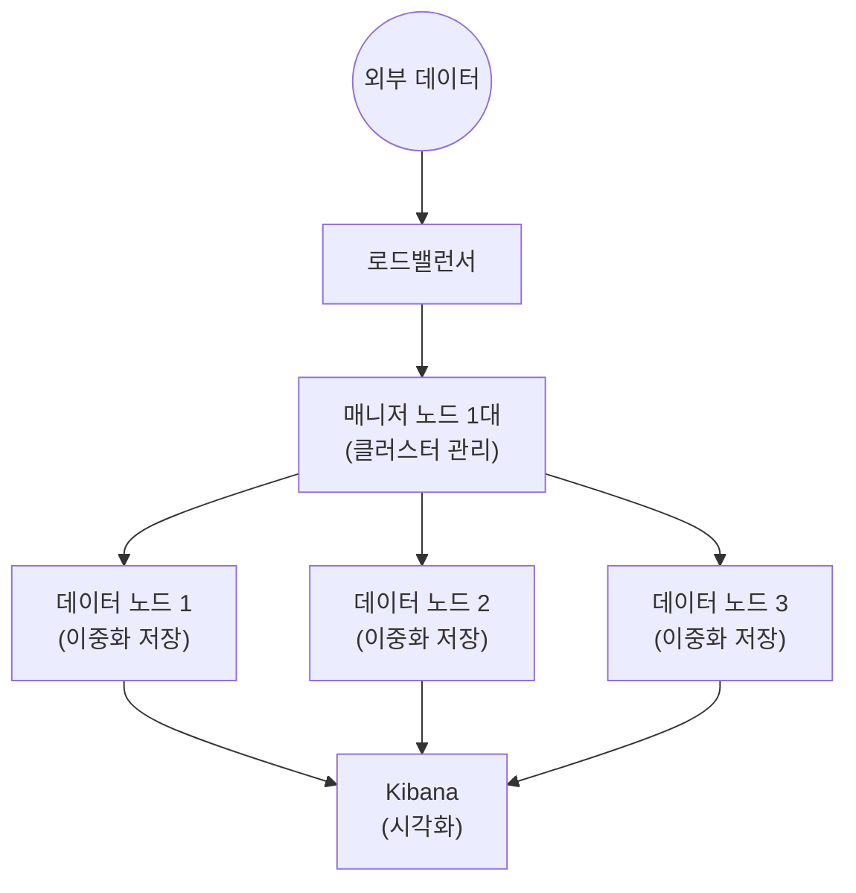
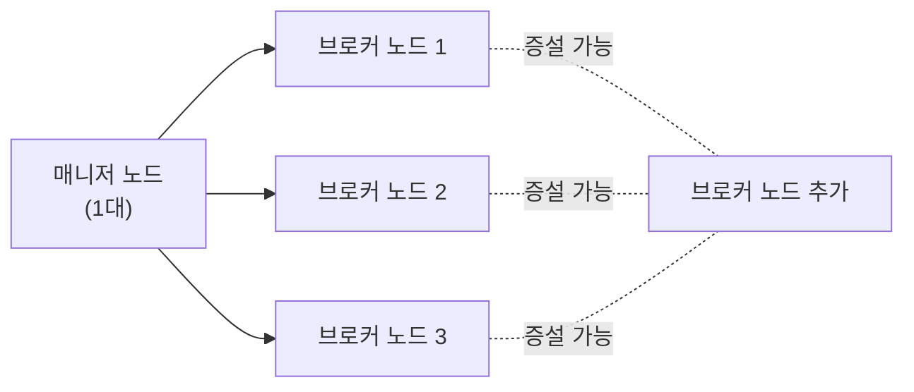
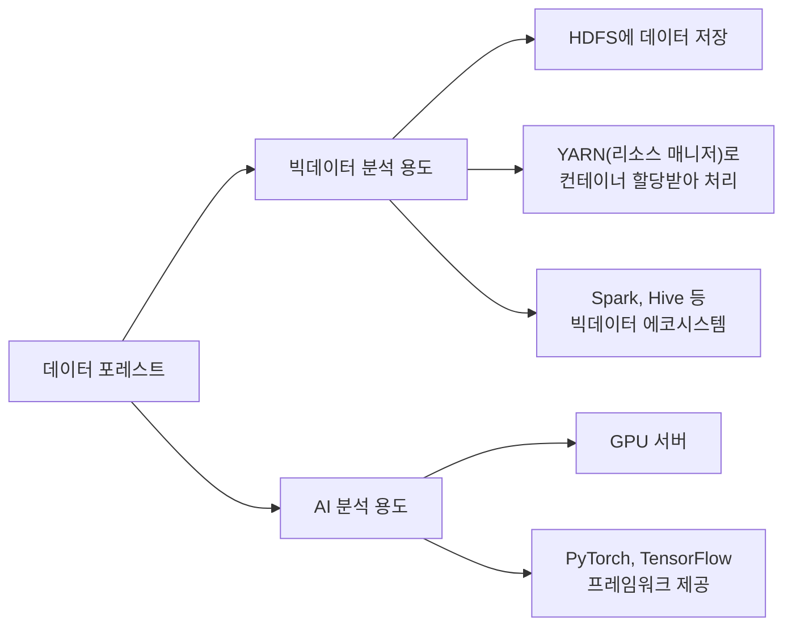
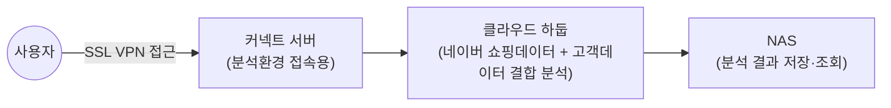

# 📘 NCP 강의 정리 — 11강. 빅데이터 앤 애널리틱스(Big Data & Analytics) 상품

> 네이버 클라우드 플랫폼(NCP) Professional 과정 **빅데이터 앤 애널리틱스** 과목을 정리한 노트입니다.

---

## 📑 목차

1. [클라우드 하둡 (Cloud Hadoop)](#1-클라우드-하둡-cloud-hadoop)
2. [클라우드 서치 (Cloud Search)](#2-클라우드-서치-cloud-search)
3. [서치 엔진 서비스 (Elasticsearch)](#3-서치-엔진-서비스-elasticsearch)
4. [클라우드 데이터 스트리밍 서비스 (Kafka)](#4-클라우드-데이터-스트리밍-서비스-kafka)
5. [데이터 애널리틱스 서비스](#5-데이터-애널리틱스-서비스)
6. [데이터 포레스트 (Data Forest)](#6-데이터-포레스트-data-forest)
7. [동형암호 기반 분석 서비스](#7-동형암호-기반-분석-서비스)
8. [클라우드 데이터 박스 (Cloud Data Box)](#8-클라우드-데이터-박스-cloud-data-box)
9. [🗺️ 서비스 한눈에 비교](#9-서비스-한눈에-비교)
10. [🔑 핵심 암기 포인트 (시험 대비)](#10-핵심-암기-포인트-시험-대비)

---

## 1. 클라우드 하둡 (Cloud Hadoop)

| 항목 | 내용 |
|---|---|
| 정의 | **하둡(Hadoop) 클러스터**(네임 노드 + 데이터 노드 집합)를 클릭 몇 번으로 손쉽게 생성해주는 **관리형 서비스** |
| 확장성 | 데이터를 분석하는 **데이터 노드의 인스턴스 수**를 콘솔에서 유연하게 확장 가능 |
| 과금 | 클라우드 특성상 **사용한 만큼만 과금** |
| 스토리지 선택 | **오브젝트 스토리지** 또는 **블록 스토리지** 중 선택 |
| 지원 프레임워크 | **Hadoop, HBase, Spark, Hive, Presto** 등 |

> 💡 **오브젝트 스토리지를 선택하면 좋은 이유**: 오브젝트 스토리지는 용량 제한이 없기 때문에, 스토리지 확장을 따로 고민할 필요 없이 **데이터 노드 개수만 관리하면 되는** 편리함이 있습니다.

---

## 2. 클라우드 서치 (Cloud Search)

| 항목 | 내용 |
|---|---|
| 정의 | 웹사이트에 필요한 **검색 기능**을 손쉽게 구현하는 서비스 |
| 사용 방법 | 검색 대상이 되는 **문서를 준비 → 클라우드 서치에 업로드**하여 검색 서비스 구현 |
| 한국어 지원 | **네이버의 한국어 형태소 분석기**가 내장되어 있어 정확한 한국어 검색 결과 제공 |
| 동작 방식 | **컨테이너 기반**으로 동작 → 유연한 확장 가능 |
| 구현 단계 | **기본 정보 → 섹션 설정 → 색인 설정 → 최종 확인**의 간단한 몇 단계로 완료 |
| 데이터 연동 | **서버 상품**이나 **Cloud DB 상품**에 저장된 데이터를 이용해서도 검색 도메인 생성 가능 |
| 모니터링 | **메모리 사용량, 인덱스 요청 건수** 등 리소스 모니터링 기능 내장 |

> 💡 기존에는 검색 서비스를 만들려면 **문서 준비 → 전처리 → 오픈소스 도구로 검색 시스템 직접 구현**이라는 복잡한 과정이 필요했지만, 클라우드 서치는 이 과정을 몇 번의 클릭으로 대폭 간소화한 서비스입니다.

---

## 3. 서치 엔진 서비스 (Elasticsearch)

| 항목 | 내용 |
|---|---|
| 정의 | **일래스틱서치(Elasticsearch) 클러스터**를 손쉽게 배포·운영하는 완전 관리형 서비스 |
| 기본 구성 | **매니저 노드 1대 + 데이터 노드 3대 이상** → 최소 **4대**로 구성 시작 |
| 매니저 노드 역할 | 외부 데이터를 받아 전달하는 **통로** + **클러스터 전체 관리** — 접근 시 **로드밸런서**를 경유 |
| 데이터 노드 역할 | 실제 데이터가 저장되는 노드, 모든 데이터는 **이중화 저장**되어 **고가용성** 확보 |
| 시각화 연계 | **키바나(Kibana)** 와 바로 연계되어 있어 별도 연동 작업 없이 분석 결과를 시각화 가능 |

---

## 4. 클라우드 데이터 스트리밍 서비스 (Kafka)

| 항목 | 내용 |
|---|---|
| 정의 | **아파치 카프카(Apache Kafka)** 클러스터를 관리형 서비스 형태로 제공 |
| 카프카란 | **링크드인(LinkedIn)** 이 개발한 **메시징 플랫폼**으로, 현재는 **오픈소스**로 제공 |
| 기본 구성 | **매니저 노드 1대 + 브로커 노드 최소 3대**부터 시작, 브로커 노드는 **증설 가능** |
| 배치 위치 | **VPC 내부**에 구성 |
| 관리 방식 | 콘솔에서 **클러스터 매니저**로 바로 연동 — **토픽 현황**, **클러스터 내부 상태** 등 확인 가능 |

> 💡 **Kafka(카프카)**는 대량의 실시간 데이터를 안정적으로 주고받기 위한 **메시지 큐/스트리밍 플랫폼**입니다. 여러 시스템 간 데이터를 실시간으로 전달·처리해야 하는 로그 수집, 이벤트 스트리밍 등에 널리 사용됩니다.

---

## 5. 데이터 애널리틱스 서비스

| 항목 | 내용 |
|---|---|
| 정의 | 웹사이트에 **네이버 애널리틱스**를 설치해, 웹사이트 **방문 로그**와 **네이버의 검색·쇼핑 데이터**를 결합 분석하는 서비스 |
| 제공 인사이트 | 내 사이트 방문자가 **어떤 사람들인지**, **언제·어디서 유입되는지** 파악 |
| 활용 목적 | 이러한 정보를 바탕으로 효과적인 **디지털 마케팅 전략 수립** 지원 |

---

## 6. 데이터 포레스트 (Data Forest)

데이터 포레스트는 크게 **두 가지 용도**로 활용할 수 있습니다.

| 용도 | 내용 |
|---|---|
| **빅데이터 분석** | **HDFS**에 데이터 저장, **YARN(리소스 매니저)** 를 통해 컨테이너를 할당받아 데이터 분석 처리, **Spark, Hive** 등 빅데이터 에코시스템 제공 |
| **AI(머신러닝) 분석** | **GPU 서버** 제공 + 머신러닝 프레임워크 **PyTorch, TensorFlow** 제공 |

---

## 7. 동형암호 기반 분석 서비스

| 항목 | 내용 |
|---|---|
| 배경 | 금융·의료·공공 부문은 개인의 민감정보를 다루며, 이 데이터는 보통 **암호화** 또는 **비식별화**되어 있음 |
| 핵심 기술 | **동형암호(Homomorphic Encryption)** — 데이터를 **암호화된 상태 그대로 연산**할 수 있는 기술 |
| 제공 가치 | 데이터 **보안을 유지**하면서도 각종 **통계 분석 작업**을 안전하게 수행 가능 |

> ⚠️ 강의 음성에서는 이 서비스명이 "해안"으로 들렸습니다. 네이버클라우드는 실제로 동형암호 전문기업 **크립토랩(CryptoLab)**, 서울대 산업수학센터와 협력하여 동형암호 기반 클라우드 분석 상품을 개발한 바 있어 강의 내용과 방향은 일치하지만, **정확한 정식 상품명은 확인이 필요**합니다. 시험 대비 시 정식 명칭은 NCP 공식 자료로 재확인하시길 권장합니다.

---

## 8. 클라우드 데이터 박스 (Cloud Data Box)

| 항목 | 내용 |
|---|---|
| 정의 | **고객이 보유한 데이터**와 **네이버가 보유한 데이터**를 결합하여 분석할 수 있는 환경 |
| 제공 형태 | 분석 인프라 + 네이버 데이터 + 고객 데이터 연계 + 전문 파트너를 한 번에 제공하는 **종합 솔루션** |
| 제공되는 네이버 데이터 | **검색, 쇼핑, AI 학습용 데이터** |

### 구조

- **SSL VPN**을 통해 접근 → **커넥트 서버**(분석 환경 접속용)를 경유
- **클라우드 하둡**을 통해 네이버의 쇼핑 데이터와 고객 데이터를 함께 분석
- 분석 결과는 **NAS**에 저장되어 조회 가능

---

## 9. 🗺️ 서비스 한눈에 비교

| 서비스 | 핵심 기반 기술 | 최소 구성 | 주 용도 |
|---|---|---|---|
| **클라우드 하둡** | Hadoop 생태계(HBase/Spark/Hive/Presto) | 네임노드+데이터노드 | 범용 빅데이터 저장·분석 |
| **클라우드 서치** | 자체 엔진(한국어 형태소 분석기 내장) | 컨테이너 기반 | 웹사이트 **검색 기능** 구현 |
| **서치 엔진 서비스** | Elasticsearch + Kibana | 매니저1+데이터3 = **4대** | 로그/데이터 **검색·분석·시각화** |
| **클라우드 데이터 스트리밍 서비스** | Apache **Kafka** | 매니저1+브로커3 | 실시간 **메시징/스트리밍** |
| **데이터 애널리틱스 서비스** | 네이버 애널리틱스 | - | 웹사이트 방문자 분석·**마케팅** |
| **데이터 포레스트** | HDFS+YARN+Spark/Hive, GPU+PyTorch/TensorFlow | - | **빅데이터 + AI** 통합 분석 |
| **동형암호 기반 분석 서비스** | 동형암호(Homomorphic Encryption) | - | 민감정보 **암호화 상태 분석** |
| **클라우드 데이터 박스** | 클라우드 하둡 + NAS + SSL VPN | - | **네이버 데이터 결합** 분석 |

> 💡 헷갈리기 쉬운 포인트: **클라우드 서치**(자체 검색엔진, 웹사이트 검색 기능 구현용)와 **서치 엔진 서비스**(Elasticsearch 기반, 로그/데이터 분석·시각화용)는 이름이 비슷하지만 **완전히 다른 서비스**입니다. 전자는 "웹사이트에 검색창을 붙인다"는 느낌, 후자는 "대량의 로그·데이터를 검색하고 키바나로 시각화한다"는 느낌으로 구분하면 좋습니다.

---

## 10. 🔑 핵심 암기 포인트 (시험 대비)

- [ ] **클라우드 하둡**: 관리형 Hadoop 클러스터, 스토리지는 **오브젝트/블록 스토리지 선택**, 지원 프레임워크 **HBase/Spark/Hive/Presto**
- [ ] **클라우드 서치**: **한국어 형태소 분석기 내장**, **컨테이너 기반**, 서버·Cloud DB 데이터로도 도메인 생성 가능
- [ ] **서치 엔진 서비스**: **Elasticsearch**, 최소 구성 = **매니저 1대 + 데이터 3대(총 4대)**, **Kibana** 연계 시각화, 데이터는 **이중화 저장**
- [ ] **클라우드 데이터 스트리밍 서비스**: **Apache Kafka**(LinkedIn 개발, 오픈소스 메시징 플랫폼), **매니저 1대 + 브로커 최소 3대**, **VPC 내부** 구성
- [ ] **데이터 애널리틱스 서비스**: 네이버 애널리틱스 + **검색/쇼핑 데이터 결합** → 마케팅 인사이트
- [ ] **데이터 포레스트**: **빅데이터**(HDFS+YARN+Spark/Hive) **+ AI**(GPU+PyTorch/TensorFlow) 겸용 플랫폼
- [ ] **동형암호 기반 분석 서비스**: 암호화된 상태 그대로 **연산 가능**(동형암호), 금융/의료/공공 분야의 민감정보 분석에 적합
- [ ] **클라우드 데이터 박스**: **네이버 데이터(검색/쇼핑/AI학습) + 고객 데이터** 결합 분석, **SSL VPN + 커넥트 서버**로 접근, 결과는 **NAS**에 저장
- [ ] **클라우드 서치 ≠ 서치 엔진 서비스** — 전자는 웹사이트 검색 기능, 후자는 Elasticsearch 기반 로그/데이터 분석

---
