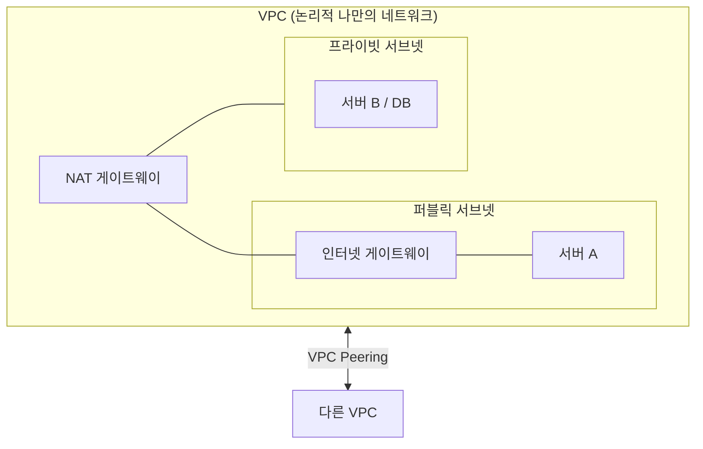
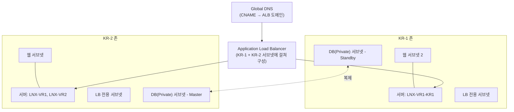

# 📘 NCP 강의 정리 — 11강. 트러블슈팅 & 고가용성(Multi-Zone) 구성

> 네이버 클라우드 플랫폼(NCP) Professional 과정 **트러블슈팅** 과목 + 이어지는 **멀티존 고가용성 구성 실습**을 정리한 노트입니다.

---

## 📑 목차

1. [클라우드 용량 산정(Capacity Planning) 기준](#1-클라우드-용량-산정capacity-planning-기준)
2. [NCP 네트워크 구조 개요](#2-ncp-네트워크-구조-개요)
3. [트래픽 허용 여부 판단 실습 (사례 분석)](#3-트래픽-허용-여부-판단-실습-사례-분석)
4. [성능 측정 / 진단 도구](#4-성능-측정--진단-도구)
5. [OS별 트러블슈팅 명령어·도구](#5-os별-트러블슈팅-명령어도구)
6. [로그 관리와 커널 파라미터](#6-로그-관리와-커널-파라미터)
7. [🧪 실습: 멀티존(Multi-Zone) 고가용성 구성](#7-실습-멀티존multi-zone-고가용성-구성)
8. [🔑 핵심 암기 포인트 (시험 대비)](#8-핵심-암기-포인트-시험-대비)

---

## 1. 클라우드 용량 산정(Capacity Planning) 기준

인프라 용량을 산정할 때 참고할 수 있는 기준입니다.

| 리소스 | 기준 |
|---|---|
| **컴퓨팅 파워** | **IO Wait**가 발생하는 시점부터 서비스 품질이 저하되므로, 리눅스에서는 **`sar`, `ps`, `top`** 등으로 CPU·리소스 사용량을 모니터링하며 산정 |
| **네트워크** | NCP 일반 서버는 **1Gbps**를 지원 — 이는 **송신+수신 트래픽을 합친 값**이므로, 서버 대수 산정 시에는 **500Mbps**를 기준으로 계산하는 것이 안전 |
| 기타 | 그 외 다양한 지표(CPU, 메모리, 디스크 IOPS 등)를 종합적으로 확인하며 산정 |

> 💡 **IO Wait란?** CPU가 디스크나 네트워크 I/O 작업이 끝나기를 기다리며 유휴 상태로 대기하는 시간의 비율입니다. IO Wait가 높다는 것은 CPU 자체보다 **디스크/스토리지 I/O가 병목**이 되고 있다는 신호이므로, 이 시점을 기준으로 스토리지 타입(SSD 전환 등)이나 서버 증설을 고려해야 합니다.
>
> 💡 **1Gbps 산정 예시**: 서버가 초당 800Mbps의 트래픽을 처리해야 하는 서비스라면, 송신+수신 합산 기준 1Gbps 한도 안에서 안전 마진(500Mbps 기준)을 고려해 **최소 2대 이상**으로 서버를 분산하는 것이 바람직합니다.

---

## 2. NCP 네트워크 구조 개요

NCP에서 네트워크를 구성할 때 사용하는 핵심 리소스들입니다.

| 구성 요소 | 설명 |
|---|---|
| **VPC** | NCP 상에서 구성하는 **나만의 논리적인 네트워크** |
| **퍼블릭 서브넷** | **외부 인터넷 통신이 가능**한 서브넷 |
| **프라이빗 서브넷** | 외부 인터넷 통신이 **불가능**한 서브넷 |
| **NAT 게이트웨이** | 프라이빗 서브넷의 리소스가 (패키지 다운로드 등을 위해) **아웃바운드 인터넷 통신**을 해야 할 때 연결 |
| **Network ACL** | **서브넷 단위**의 트래픽(인/아웃바운드) 조정 |
| **ACG** | **서버(네트워크 인터페이스) 단위**의 방화벽 |
| **VPC Peering** | 서로 다른 VPC 간에 **사설 통신**이 필요할 때 연결 |

> 💡 **정리**: "서브넷 레벨 방화벽 = Network ACL", "서버 레벨 방화벽 = ACG" 로 역할이 명확히 구분됩니다. 트래픽 하나가 목적지에 도달하려면 **두 단계 모두**를 통과해야 합니다.

---

## 3. 트래픽 허용 여부 판단 실습 (사례 분석)

> 📌 **판단 순서**: 트래픽이 서브넷 경계를 통과한다면 **① Network ACL 확인 → ② 목적지 서버의 ACG 확인** 순으로 봐야 합니다. (단, **같은 서브넷 내부 통신은 Network ACL을 거치지 않고 ACG만 적용**됩니다 — 아래 예제 2-② 참고)

### 예제 1 — 웹 NACL: "SSL VPN 대역만 ICMP 허용, 나머지는 Deny"

| # | 시나리오 | 판단 과정 | 결과 |
|---|---|---|---|
| ① | 사용자(SSL VPN 통해 접속) → **서버 A 사설 IP** ping | 웹 NACL: SSL VPN 대역 ICMP 허용 → 통과 / ACG: SSL VPN 대역 ICMP 허용 → 통과 | ✅ **성공** |
| ② | 사용자 → **서버 A 공인 IP** ping | 웹 NACL: SSL VPN 대역이 아닌 트래픽은 **Deny** | ❌ **실패** (NACL 단계에서 차단) |
| ③ | 사용자 → **로드밸런서 도메인** ping | 로드밸런서 장비는 **기본적으로 ICMP(ping) 요청 자체를 차단** | ❌ **실패** |
| ④ | **서버 A → 서버 B**(다른 서브넷, 동일 웹 NACL 적용) 사설 IP ping | 웹 NACL이 SSL VPN 대역만 ICMP 허용 → 서버 간 트래픽은 이 조건에 해당하지 않음 | ❌ **실패** |

> 💡 로드밸런서가 ping에 응답하지 않는 것은 **정상 동작**입니다. 로드밸런서의 헬스체크는 ICMP가 아니라 **HTTP/HTTPS 등 프로토콜 기반**으로 이뤄지므로, "로드밸런서가 ping이 안 된다 = 장애"로 오판하지 않도록 주의해야 합니다.

### 예제 2 — 웹 NACL: "모든 대역에 대해 ICMP Deny" / ACG: "10.0.0.0/8 대역 ICMP 허용"

| # | 시나리오 | 판단 과정 | 결과 |
|---|---|---|---|
| ⑤ | **서버 A → 서버 C**(다른 서브넷) 사설 IP ping | 웹 NACL이 **모든 대역에 대해 ICMP Deny** | ❌ **실패** (NACL 단계에서 차단) |
| ⑥ | **서버 A → 서버 B**(같은 서브넷) 사설 IP ping | **같은 서브넷 내부 통신이므로 Network ACL은 적용되지 않고 ACG만 확인** → ACG가 10.0.0.0/8 대역 ICMP 허용 | ✅ **성공** |

> 💡 **가장 중요한 포인트**: 예제 2의 ⑥번처럼 **같은 서브넷 안에서 오가는 트래픽은 Network ACL의 검사를 받지 않습니다.** Network ACL은 서브넷의 "경계"를 넘나드는 트래픽에만 적용되기 때문입니다. 반면 ACG는 트래픽이 어디서 오든 항상 서버(네트워크 인터페이스) 단에서 검사합니다. 이 차이는 시험에 자주 출제되는 포인트이니 꼭 기억해 두세요.

---

## 4. 성능 측정 / 진단 도구

### 4.1 웹 서비스 성능 측정 도구

| 도구 | 설명 |
|---|---|
| **WMS (Web service Monitoring System)** | NCP의 자체 서비스. 모니터링할 **웹 페이지 URL**을 등록하면 24/7 가용성·응답속도 등을 모니터링 (공식 문서 확인) |
| **nGrinder (엔그라인더)** | **네이버(Naver)가 만든 오픈소스 부하테스트(성능테스트) 도구** — 스크립트 작성부터 테스트 실행, 모니터링, 결과 리포트까지 통합 제공 |
| **Pinpoint (핀포인트)** | NCP가 제공하는 **분산 추적(Distributed Tracing)** 오픈소스 APM |
| **ab (Apache Bench)** | 아파치에서 제공하는 경량 부하테스트 도구. `yum install httpd-tools`로 설치, **동시 요청 수** 등을 옵션으로 지정해 벤치마크 수행 |

### 4.2 MySQL(데이터베이스) 성능 측정 도구

| 도구 | 설명 |
|---|---|
| **Percona Toolkit (퍼코나)** | MySQL 진단·성능 분석에 특화된 오픈소스 툴킷 |
| **sysbench (시스벤치)** | DB/시스템 벤치마크용 오픈소스 도구 |
| **Apache JMeter (제이미터)** | 웹/DB 등 다양한 프로토콜을 지원하는 범용 부하테스트 도구 |

### 4.3 관리형 서비스 자체 진단 기능

- NCP의 **완전 관리형 데이터베이스**(Cloud DB for MySQL 등)는 **대시보드가 기본 내장**되어 있어 별도 도구 없이도 주요 지표 확인 가능

> 💡 STT(음성→ 텍스트) 특성상 강의 원문에는 "WMS", "앵글라인", "페르소나" 등으로 들렸으나, NCP 공식 문서 및 실제 도구명을 기준으로 각각 **WMS(Web service Monitoring System)**, **nGrinder**, **Percona**로 교정하여 정리했습니다.

---

## 5. OS별 트러블슈팅 명령어·도구

### 5.1 Linux

| 명령어 | 용도 |
|---|---|
| **`sar`** | CPU, 메모리, I/O Wait 등 **리소스 사용량 전반**을 확인 (`-a`: 전체, `-b`: I/O, `-n`: 네트워크) |
| **`ping`** | 특정 호스트의 생사(응답 여부) 확인. ⚠️ 최근에는 **방화벽에서 ICMP를 차단**하는 경우가 많아 응답이 없다고 반드시 장애는 아님 |
| **`nmap` (엠맵)** | 특정 포트가 **열려 있는지 스캔**. 단일 호스트뿐 아니라 **대역(범위) 스캔**, 방화벽으로 보호된 호스트 탐지도 가능 |
| **`traceroute`** | ICMP와 **TTL 값**을 이용해 목적지까지의 **경로**를 확인 (일부 구간에서 ICMP 무응답 시 부정확할 수 있음) |
| **`ps`** | 현재 실행 중인 **프로세스 목록** 확인 |
| **`lsof` (list open files)** | 특정 프로세스가 **어떤 파일/포트를 점유**하고 있는지 확인 |
| **`tcpdump`** | 네트워크 트래픽을 실시간으로 **패킷 캡처/모니터링** |

### 5.2 Windows

| 도구 | 용도 |
|---|---|
| **TCPView** | 프로세스별로 어떤 프로토콜/주소/포트로 통신 중인지 **실시간 네트워크 연결 확인** (Sysinternals 도구, 별도 설치) |
| **Microsoft Message Analyzer** | 네트워크 트래픽/메시지를 종합적으로 분석 (별도 설치) |
| **이벤트 뷰어 (Event Viewer)** | **시스템/보안/응용 프로그램 로그**를 확인. 리눅스의 syslog와 유사한 역할 |
| **성능 모니터 (Performance Monitor)** | 프로세스, 메모리 등 주요 리소스를 모니터링하고 **진단 보고서**까지 작성 가능 |
| **디버그 진단 도구 (Debug Diagnostic Tool)** | 프로세스의 크래시, 메모리 누수(Leak) 패턴 등을 진단 |
| **Xperf / PAL(Performance Analysis of Logs)** | 서버 타입별 **성능 카운터 오브젝트**를 제공하여, 임계값(Threshold) 기반의 상세 성능 분석 리포트가 필요할 때 사용 |

---

## 6. 로그 관리와 커널 파라미터

### 6.1 로그 경로

| OS | 경로/방법 |
|---|---|
| **Linux** | 일반 시스템 로그: `/var/log` / HTTP(웹서버) 로그: `/var/log/httpd` |
| **Windows** | **이벤트 뷰어**를 통해 시스템/보안/응용 프로그램 로그 확인 |

> ⚠️ 로그는 실시간으로 계속 쌓이기 때문에 관리하지 않으면 **디스크가 가득 차 서비스 장애**로 이어질 수 있습니다. **로그 로테이트(Log Rotate)** 를 통해 주기적으로 로그를 삭제하거나 압축하여 관리해야 합니다.

### 6.2 커널 파라미터

| 항목 | 내용 |
|---|---|
| **변경 명령어** | `sysctl` — 커널 파라미터 값을 조회/변경 |
| **사용자별 리밋 설정** | `/etc/security/limits.conf` 파일에서 변경 |
| **오픈 가능한 파일 개수** | `/etc/sysctl.conf`의 **`fs.file-max`** 값을 변경 |
| **TCP 타임아웃 값** | 서비스 운영 특성에 맞게 `sysctl`로 조정 |

---

## 7. 🧪 실습: 멀티존(Multi-Zone) 고가용성 구성

기존에 **KR-2 존**에만 위치하던 인프라에 **KR-1 존**을 추가하여, 존(Zone) 장애에도 서비스가 지속될 수 있는 **고가용성(HA) 아키텍처**를 구성하는 실습입니다.

### 7.1 절차 요약

1. **KR-1 존 서브넷 추가**
   - 웹 서브넷(퍼블릭), **로드밸런서 전용 서브넷**(퍼블릭), **DB 배치용 서브넷**(프라이빗, 인터넷 게이트웨이 사용 안 함) — 총 3개 서브넷을 KR-1 존에 생성
2. **서버 추가 생성**: 기존 **내 서버 이미지**를 기반으로 KR-1 존 서브넷에 서버(`LNX-VR1-KR1`) 생성 → 기존 인증키·ACG 재사용
3. **타겟 그룹(Target Group) 생성**: ALB에 바인딩할 타겟 그룹 생성 — 프로토콜 HTTP/포트 80, 헬스체크(HTTP 80, HEAD 메소드, 주기 30초, 임계값 2), 대상 서버로 기존 서버들 + 신규 서버(KR-1) 모두 선택
4. **애플리케이션 로드밸런서(ALB) 생성**: **KR-1존 서브넷 + KR-2존 서브넷을 모두 선택**하여 **존 간 이중화** 구성 → 각 존마다 공인 IP 신청 → 리스너(HTTP:80) 및 타겟 그룹 연결
5. **Cloud DB Multi-Zone 옵션 적용**: DB 생성 시 **멀티존 옵션** 선택 → **마스터와 스탠바이 서버가 서로 다른 존의 프라이빗 서브넷에 배치**
6. **DB 연동 설정**: 웹 서버의 DB 접속 설정 파일에 **프라이빗 도메인** 반영, DB 유저 추가, API 인증키(Access Key/Secret Key) 반영
7. **ACG 오픈**: Cloud DB가 자동 생성한 ACG에 **TCP 3306 포트** 인바운드/아웃바운드 허용 규칙 추가 (기본은 자기 자신만 허용되어 있어 서버 접근이 차단된 상태)
8. **Global DNS 도메인 설정**: 도메인 등록 → **CNAME 레코드**를 ALB의 도메인으로 연결 → 설정 적용(배포)
9. **접속 테스트**: 등록한 도메인으로 접속 시 **로드밸런서를 통해 KR-1존/KR-2존 서버로 라운드 로빈(Round Robin) 방식**으로 트래픽이 분산되는 것을 확인

> 💡 **이 아키텍처의 핵심**: ① 서버는 **두 개 이상의 존에 분산 배치**, ② **로드밸런서가 여러 존의 서브넷에 걸쳐 구성**되어 트래픽을 분산, ③ **DB는 Multi-Zone 옵션으로 마스터/스탠바이를 다른 존에 배치**. 이 세 가지가 합쳐져야 **하나의 존(Zone)에 장애가 발생해도 서비스가 지속되는 진정한 고가용성 구조**가 완성됩니다.

---

## 8. 🔑 핵심 암기 포인트 (시험 대비)

- [ ] NCP 일반 서버 네트워크 대역폭: **1Gbps (송신+수신 합산)** → 서버 대수 산정 시 **500Mbps** 기준 권장
- [ ] **Network ACL = 서브넷 단위 방화벽 / ACG = 서버(NIC) 단위 방화벽**
- [ ] **⭐ 같은 서브넷 내부 통신은 Network ACL을 거치지 않고 ACG만 적용된다**
- [ ] **로드밸런서는 기본적으로 ICMP(ping) 요청에 응답하지 않음** (장애 아님)
- [ ] 웹 성능 측정 도구: **WMS(NCP), nGrinder(네이버 오픈소스), Pinpoint(분산추적), Apache Bench**
- [ ] MySQL 성능 측정 도구: **Percona, sysbench, JMeter**
- [ ] Linux 트러블슈팅 명령어: **sar, ping, nmap, traceroute, ps, lsof, tcpdump**
- [ ] Windows 트러블슈팅 도구: **TCPView, Message Analyzer, 이벤트 뷰어, 성능 모니터, Debug Diagnostic Tool, Xperf/PAL**
- [ ] 커널 파라미터 변경: **`sysctl`** / 사용자별 리밋: **`limits.conf`** / 파일 오픈 개수 제한: **`fs.file-max`**
- [ ] 멀티존 고가용성 = **서버 분산 배치 + ALB의 멀티존 서브넷 구성 + Cloud DB Multi-Zone(마스터/스탠바이 존 분리)**
- [ ] Global DNS에서 도메인을 로드밸런서에 연결할 때는 **CNAME 레코드** 사용, 반드시 **설정 적용(배포)** 까지 진행해야 반영됨

---
